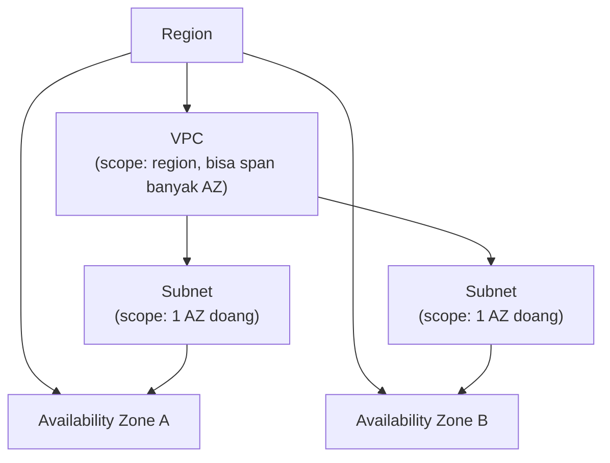
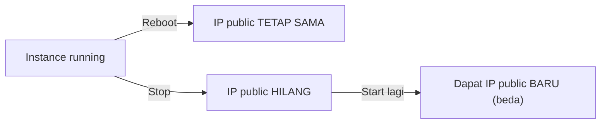

Dua lab hari ini sama-sama muter di soal IP dan struktur jaringan AWS, dan ternyata dua-duanya saling nyambung.

## Hierarki: Region, VPC, AZ, Subnet

VPC itu analoginya kayak "data center milik sendiri" di dalam satu region, privat dan terisolasi dari VPC orang lain secara default.

Aturan pentingnya:
- **VPC** scope-nya region, dan bisa "menjangkau" (span) banyak AZ sekaligus.
- **Subnet** scope-nya cuma **satu AZ**, nggak bisa nyebar ke banyak AZ.
- Satu AZ bisa punya banyak subnet, tapi satu subnet cuma nempel ke satu AZ.

Default per akun: 1 VPC per region, dengan soft limit sampai 5 VPC (bisa nambah lewat request ke AWS Support kalau butuh lebih, dengan tambahan biaya).

## Public vs Private Subnet

- **Public subnet**: didesain buat diakses publik, biasanya isinya web server. Konsekuensinya: siapa aja bisa akses, baik maupun jahat.
- **Private subnet**: cuma bisa diakses dari internal (VPN, instance lain dalam VPC), biasanya isinya app server atau database.

Prinsip pentingnya: **jangan pernah taruh database di public subnet**. Layer paling dalam dari sebuah arsitektur itu biasanya database, kalau database sampai kena breach, itu tanda arsitekturnya bermasalah dari awal.

## Lab: Kenapa Satu Instance Bisa Internetan, Satu Lagi Nggak

Skenario lab: dua instance (A dan B) dengan konfigurasi dan subnet yang sama persis, tapi instance A nggak bisa akses internet sementara B bisa. Setelah diinvestigasi, jawabannya sederhana: **instance A nggak punya IP public**. Apapun yang mau internetan wajib punya IP public, itu aturan dasarnya.

_Satu VPC dengan internet gateway, instance A dan B di public subnet yang sama, di Availability Zone 1._

_Instance A: kolom Public IPv4 kosong, cuma ada IP private 10.0.10.100._

_Instance B: punya IP public 54.71.89.239 plus IP private 10.0.10.166, VPC dan subnet-nya sama persis kayak A._

Investigasi lanjutan soal remote SSH juga ngasih insight yang sama: SSH ke instance yang cuma punya IP private itu **bisa**, asalkan dilakukan dari dalam network yang sama (misal dari instance lain yang satu VPC), bukan dari luar. Jadi:

- Mau remote dari luar (internet) ke instance → butuh IP public di instance tujuan.
- Mau remote antar-instance dalam satu network → cukup pakai IP private, nggak perlu IP public sama sekali.

## Reboot vs Stop: Beda Nasib buat IP Public

Ini bagian paling nempel dari lab hari ini:

- **Reboot**: instance-nya cuma "restart aplikasi", metadata dan network interface-nya tetep nyangkut, jadi IP public-nya nggak berubah.
- **Stop lalu Start**: instance-nya bener-bener "dibongkar", pas start lagi dia dapet alokasi IP public baru dari pool AWS, sehingga IP-nya berubah.

_Tempat nyatet IP public dan IP private (plus DNS name-nya) sebelum instance di-stop, buat dibandingin setelah di-start lagi._

Sementara **IP private** itu selalu tetap, nggak peduli reboot atau stop, karena dia nempel ke network interface instance-nya yang tetap ada meskipun instance-nya mati. IP private ini ditentukan lewat mekanisme mirip DHCP reservation, semi-manual (kita tentuin rentang IP-nya, tapi assignment aktualnya otomatis).

## Elastic IP: Solusi buat IP Public yang Permanen

Kalau butuh IP public yang nggak berubah-ubah (misal buat DNS record yang stabil), solusinya pake **Elastic IP**, IP public statis yang bisa "dicolok-lepas" (associate/disassociate) ke instance manapun sesuka hati.

_Elastic IP 54.244.33.245 dipasang ke test instance lewat Actions, Associate Elastic IP address._

Poin pentingnya:
- Kalau instance yang nempel Elastic IP di-delete, IP-nya **nggak ikut hilang**, cuma "kecabut", dan masih bisa dipasang lagi ke instance lain.
- Elastic IP itu **berbayar**, termasuk pas **nggak dipakai** (nggak nempel ke instance manapun). Jadi kalau udah nggak butuh, jangan cuma di-disassociate, tapi di-**release**.
- Update soal biaya: sejak Februari 2024, AWS nagih **semua IPv4 public**, termasuk IP public dinamis yang auto-assign, sekitar $0,005 per jam per IP (kurang lebih $3,6 per bulan). Jadi IP public dinamis juga udah nggak gratis. Pengecualiannya cuma kuota free tier 750 jam per bulan di 12 bulan pertama akun.

| | IP Public Dinamis (default) | Elastic IP (statis) |
|---|---|---|
| Berubah saat stop/start? | Ya, dapat IP baru | Tidak, tetap sama |
| Biaya | Berbayar selama nempel ke instance (sejak Feb 2024), hilang sendiri pas instance di-stop | Berbayar terus selama dialokasikan, dipakai atau idle, sampai di-release |
| Cocok buat | Instance yang IP-nya nggak krusial dicatat di tempat lain | Server yang butuh IP tetap (DNS, whitelist firewall eksternal, dst) |

## Yang Perlu Diinget

- VPC itu scope-nya region dan bisa span banyak AZ, subnet itu scope-nya cuma satu AZ.
- Jangan pernah taruh database di public subnet, itu prinsip dasar desain arsitektur yang aman.
- SSH ke instance tanpa IP public tetap bisa, asal dilakukan dari dalam network yang sama pakai IP private.
- Reboot instance nggak mengubah IP public, tapi stop-lalu-start pasti dapat IP public baru.
- Elastic IP itu solusi buat IP public permanen, tapi berbayar bahkan saat idle. IP public dinamis juga berbayar sejak Februari 2024, bedanya dia ikut hilang pas instance di-stop.

## Referensi Resmi

- [VPCs and Subnets](https://docs.aws.amazon.com/vpc/latest/userguide/configure-subnets.html)
- [Elastic IP Addresses](https://docs.aws.amazon.com/AWSEC2/latest/UserGuide/elastic-ip-addresses-eip.html)
