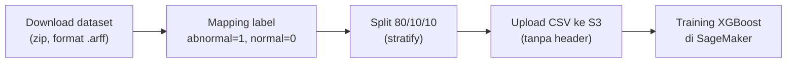

Ini lab terakhir di re/Start (lab 316). Nggak panjang, sekitar 30 sampe 45 menit, tapi lumayan buat ngerasain "mentahan"-nya bikin model machine learning kayak gimana. Tugasnya baru setengah jalan sih: split data terus training. Evaluasi lengkap dan deploy belum masuk.

## Skenario: Deteksi Kelainan Ortopedi

Ceritanya kita kerja di provider kesehatan yang mau ningkatin deteksi kelainan pada pasien ortopedi (tulang belakang, saraf kejepit, yang kayak gitu). Datanya **biomechanical features**: 6 ukuran dari panggul dan tulang belakang pasien.

- Total **310 pasien**: **100 normal**, **210 abnormal**.
- Yang abnormal aslinya dua jenis penyakit (disk hernia dan spondylolisthesis), tapi di lab ini digabung jadi satu kategori **abnormal**.
- Datanya dari dokter Henrique da Mota waktu residensi di grup riset ortopedi di Prancis.

Karena cuma ada dua kemungkinan (normal atau abnormal), ini namanya **binary classification**. Kalau jenis penyakitnya dipisah, jadinya multi-class classification, lebih ribet.

Satu hal yang langsung diwanti-wanti instruktur: datanya **nggak seimbang** (100 vs 210). Model yang belajar dari data kayak gini cenderung "gampang nuduh" pasien abnormal, mirip rapid test zaman corona yang gampang nunjukin positif.

## Alur Lab



### 1. Buka notebook di SageMaker

Masuk ke **SageMaker AI** → **Notebook instances** → buka **JupyterLab**, pilih kernel `conda_python3`. Notebook instance ini sebenarnya EC2 yang udah ada Jupyter-nya, anggap aja **Google Colab versi bayar**. Di lab-nya pakai tipe `ml.m4.xlarge`, dan ini **nggak murah**. Selama statusnya *InService*, argonya jalan terus, dipake atau nggak.

Tips dari instruktur: ngoding dan eksperimen di lokal (atau Google Colab yang gratis) dulu, baru pindah ke SageMaker pas udah siap. Kalau all-in dari awal di SageMaker, billing-nya bisa bikin kaget.

Kenapa notebook dijalanin per blok (cell)? Biar kalau error, ketahuan di blok mana. Tiap blok juga ada output-nya, jadi bisa ngecek data sebelum lanjut ke training. Urutannya tetap dari atas ke bawah ya.

### 2. Mapping label

Kolom `class` isinya teks (`Abnormal`, `Normal`). Model ML itu urusannya matematika, **nggak bisa ngolah string**, jadi label diubah jadi angka: abnormal = 1, normal = 0. Hasilnya dicek: **310 baris, 7 kolom** (6 fitur + 1 kelas).

> Di kelas teknik ini disebut one-hot encoding. Kalau mau teliti, ngubah satu kolom label jadi 0/1 kayak gini lebih pas disebut **label encoding** (atau binary mapping). One-hot itu kalau satu kategori dipecah jadi beberapa kolom 0/1.
{: .prompt-info }

Kolom kelas juga digeser dari ujung kanan ke ujung kiri. Instruktur bilang ini cuma biar enak dilihat, tapi ternyata ada alasan teknisnya: algoritma XGBoost bawaan SageMaker kalau pakai input CSV **mewajibkan kolom target di kolom pertama**, dan filenya **tanpa header**.

### 3. Split data 80/10/10

Data dipecah dua kali pakai `train_test_split` dari scikit-learn. Kurang lebih bentuknya kayak gini (ditulis ulang dari penjelasan di kelas, bukan salinan persis notebook-nya):

```python
from sklearn.model_selection import train_test_split

train, test_and_validate = train_test_split(
    df, test_size=0.2, random_state=RANDOM_STATE, stratify=df['class'])

test, validate = train_test_split(
    test_and_validate, test_size=0.5, random_state=RANDOM_STATE,
    stratify=test_and_validate['class'])
```

Split pertama 80% training dan 20% sisa, split kedua sisa 20% itu dibagi dua jadi 10% test dan 10% validasi. `random_state` itu buat ngacak data (tapi hasil acakannya konsisten kalau dijalanin ulang). Yang penting itu `stratify`: pembagiannya dibikin **proporsional per kelas**, jadi rasio normal/abnormal di tiap bagian sama.

| Bagian | Abnormal | Normal | Total |
|---|---|---|---|
| Training (80%) | 168 | 80 | 248 |
| Test (10%) | 21 | 10 | 31 |
| Validasi (10%) | 21 | 10 | 31 |

Stratify ini bukan nyeimbangin data (tetap 2:1), tapi mastiin ketidakseimbangannya **sama rata** di training, test, dan validasi.

Kalau lupa install library, error `No module named sklearn` bakal muncul. Tinggal tambah cell di atas `pip install scikit-learn` (bukan `sklearn`), terus restart kernel.

### 4. Upload ke S3, terus training

Tiap bagian disimpan jadi CSV dengan `header=False, index=False`, lalu di-upload ke bucket S3. Training-nya pakai container **XGBoost bawaan AWS**, jadi nggak perlu nulis algoritmanya sendiri.

```python
hyperparams = {
    "num_round": "42",
    "eval_metric": "auc",
    "objective": "binary:logistic"
}
```

- `num_round`: berapa kali iterasi training.
- `eval_metric: auc`: model dievaluasi pakai AUC.
- `objective: binary:logistic`: klasifikasi dua kelas.

Training job-nya jalan di **server terpisah** (satu instance `ml.m4.xlarge` lagi). Jadi pas training, ada dua server yang nyala: notebook dan training. Di lab, training job-nya selesai sekitar 5 menit. Lamanya training tergantung tiga hal: **ukuran data**, **algoritma dan settingannya**, dan **spek serta jumlah server**.

## Konsep yang Dibahas di Sela-Sela Lab

### Kenapa nggak 100% buat training?

Kalau semua data dipake buat training, model bukan **belajar**, tapi **ngapalin**. Belajar itu bisa **generalisasi**: ketemu data baru pun tetap bisa nangkep polanya. Makanya ada bagian yang disisihin:

- **Training**: bahan belajar.
- **Validasi**: ngecek seberapa efektif belajarnya (validation accuracy). Mirip "kamu bilang udah belajar, coba jawab soal ini".
- **Test**: ngukur **loss** di data yang bener-bener belum pernah dilihat.

### Overfitting vs underfitting

| Kondisi | Akurasi training | Akurasi validasi | Artinya |
|---|---|---|---|
| **Overfitting** | tinggi (misal 80%) | jauh lebih rendah (misal 60%) | model ngapalin, bukan belajar. Variance tinggi |
| **Underfitting** | rendah | rendah | model nggak belajar apa-apa. Bias tinggi |
| **Model yang baik** | tinggi | kurang lebih sama | trade-off bias dan variance seimbang |

Seiring training, bias (error) turun, tapi variance naik. Titik terbaiknya di tengah, pas dua-duanya seimbang. Konsep dasarnya udah pernah disinggung di [taksonomi AI dan ML](/blog/ai-ml-deep-learning-generative-ai-taksonomi).

### Kualitas data itu 90% kerjaan

Kalau mau bikin model deteksi anjing tapi dari 1.000 gambar ternyata 100-nya kucing, datanya jelek, modelnya pasti jelek juga. Data bagus aja belum tentu jadi model bagus, apalagi data jelek. Prinsipnya sama kayak [garbage in, garbage out](/blog/data-buat-machine-learning-gigo-bias-feature-engineering). Kata instruktur, 90% kerjaan itu ngurus data, sisanya tuning.

### Kenapa pakai XGBoost dan AUC?

Pemilihan algoritma mulai dari kebutuhannya dulu (klasifikasi, regresi, clustering, dll). Buat klasifikasi pilihannya banyak (KNN, SVM, XGBoost), dan XGBoost itu kelas beratnya: analogi instruktur, kalau KNN motor 100 cc, XGBoost itu 250 cc.

AUC (area under the ROC curve) dibaca gampang: makin luas area di bawah kurva, makin bagus. **AUC 0,5 = tebak-tebakan** (garis lurus diagonal, model sampah), makin mendekati 1 makin bagus.

## Yang Perlu Diinget

- Split data 80/10/10 buat training, validasi, test. `stratify` bikin proporsi kelas sama di tiap bagian.
- Training 100% = ngapalin. Validasi buat ngecek belajarnya efektif atau nggak.
- Overfitting: training tinggi, validasi rendah. Underfitting: dua-duanya rendah.
- Label teks harus diubah jadi angka dulu. XGBoost SageMaker (CSV) mau kolom target di depan, tanpa header.
- Notebook instance dan training job sama-sama makan biaya selama nyala. Matiin kalau udah selesai.

## Referensi Resmi

- [XGBoost Algorithm with Amazon SageMaker AI](https://docs.aws.amazon.com/sagemaker/latest/dg/xgboost.html)
- [Amazon SageMaker Notebook Instances](https://docs.aws.amazon.com/sagemaker/latest/dg/nbi.html)
- [Train a Model with Amazon SageMaker](https://docs.aws.amazon.com/sagemaker/latest/dg/how-it-works-training.html)
