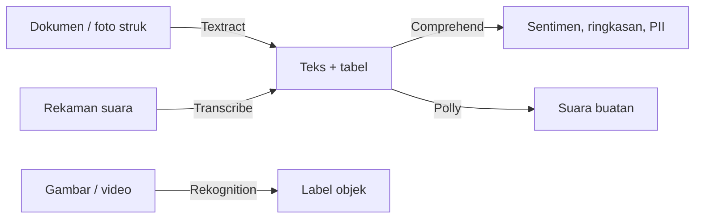

Minggu terakhir re/Start dibuka pakai review service AI di AWS. Kenapa diulang lagi padahal minggu kemarin udah [3 hari materi AI](/blog/aws-restart-week6-hari-3-materi-ai-hari-pertama)? Soalnya di ujian, domain "cloud technology and services" itu bobotnya sekitar 34%, dan salah satu isinya ya ngapalin service. Jadi daripada ketuker pas ujian, mending dihafalin sekarang.

## Service AI "Siap Pakai"

Ini kelompok service yang tinggal dipake, nggak perlu bikin model sendiri. Kuncinya: tau **inputnya apa** dan **outputnya apa**.

| Service | Input → Output | Contoh kasus |
|---|---|---|
| **Amazon Lex** | teks/suara → percakapan | chatbot, "mbahnya" NLP sebelum ada LLM dan agent |
| **Amazon Textract** | dokumen/gambar → teks + data terstruktur | struk belanja difoto, isinya diubah jadi tabel biar gampang dianalisis |
| **Amazon Rekognition** | gambar/video → label objek | computer vision, object detection, kayak e-tilang |
| **Amazon Polly** | teks → suara | text to speech, suaranya bisa dipilih atau di-custom |
| **Amazon Transcribe** | suara → teks | speech recognition, kayak subtitle otomatis di YouTube |
| **Amazon Comprehend** | teks nggak terstruktur → insight | sentiment analysis, ringkasan, deteksi dan redaksi data pribadi (PII) |

Cara ngapalinnya gampang: Polly sama Transcribe itu kebalikan. Polly **ngomong** (teks jadi suara), Transcribe **nyatet** (suara jadi teks). Kalau soalnya bawa-bawa "analisis teks" atau "sentimen", itu Comprehend, bukan Textract. Textract itu **ngambil** teks dari dokumen, Comprehend itu **ngerti** isi teksnya.

Soal Polly dan Transcribe, ada juga bahasan risikonya di post [vector database dan RAG](/blog/vector-database-rag-embedding).

## SageMaker AI vs Bedrock

Ini yang paling sering ketuker. Singkatnya:

- **Amazon SageMaker AI**: platform **end-to-end ML lifecycle**. Siapin data, training, evaluasi, sampe deploy. Dipake kalau mau **bikin model sendiri dari nol** atau fine-tuning yang ribet.
- **Amazon Bedrock**: akses **foundation model (LLM) siap pakai**. Nggak perlu training dari nol, tinggal pakai, fine-tuning, atau pasang guardrail.

Aturan praktisnya dari instruktur: kalau butuh foundation model LLM, pilih **Bedrock**. Kalau ML biasa atau deep learning bikin sendiri, pilih **SageMaker**. Kalau di soal ada dua opsi "SageMaker" dan "SageMaker AI", pilih yang ada **AI**-nya, karena itu nama baru service-nya.

Perbandingan lebih panjang soal biaya dan ukuran model ada di post [ukuran model vs kepintaran AI](/blog/ukuran-model-vs-kepintaran-ai-spesialisasi).

### Fitur SageMaker yang disebut

- **SageMaker JumpStart**: kalau mau pakai foundation model end-to-end di SageMaker. Kata kuncinya "JumpStart".
- **Endpoint**: model yang udah jadi di-deploy jadi endpoint, bisa serverless. Ada mode **shadow**: traffic tetap jalan ke model lama, tapi di-mirror ke model baru buat ngetes. Mirip blue/green deployment, tapi buat model AI.
- **SageMaker Ground Truth**: buat **labeling data** (data annotation). Bobotnya lumayan di ujian AI, jadi instruktur nyaranin dihafal. Nyambung sama materi [data labeling](/blog/data-labeling-object-detection-image-segmentation).
- **Domain**: buat pakai SageMaker Studio, harus bikin **domain** dulu, dan itu **nggak gratis**.

### Fitur Bedrock yang disebut

- **Guardrails**: filter input dan output model, udah dibahas di post [responsible AI](/blog/responsible-ai-guardrails-prompt-injection).
- **Prompt router**: ngatur prompt tertentu dilempar ke model mana, persentasenya bisa diatur.
- **Import model**: model yang udah di-fine-tune sendiri bisa diimpor.
- **Evaluasi pakai LLM as a judge**: model dievaluasi pakai LLM lain. Kalau di luar AWS, tools open source yang sering dipake buat evaluasi RAG namanya **RAGAS** (ngukur relevansi konteks, kebenaran, kelengkapan jawaban).

## Yang Perlu Diinget

- Service AI siap pakai: hafalin pasangan input → output-nya. Polly (teks → suara) kebalikan Transcribe (suara → teks).
- Textract **ngambil** teks dari dokumen, Comprehend **ngerti** isi teks.
- SageMaker AI buat bikin model sendiri (end-to-end ML), Bedrock buat foundation model siap pakai.
- Ground Truth = labeling data, JumpStart = foundation model di SageMaker.
- Buat CCP cukup ngerti bedanya di level ini, nggak perlu sedalam ujian AI atau ML associate.

## Referensi Resmi

- [AI Services on AWS](https://aws.amazon.com/ai/services/)
- [Amazon SageMaker AI](https://aws.amazon.com/sagemaker/)
- [Amazon Bedrock](https://aws.amazon.com/bedrock/)
- [Amazon SageMaker Ground Truth](https://aws.amazon.com/sagemaker/groundtruth/)
