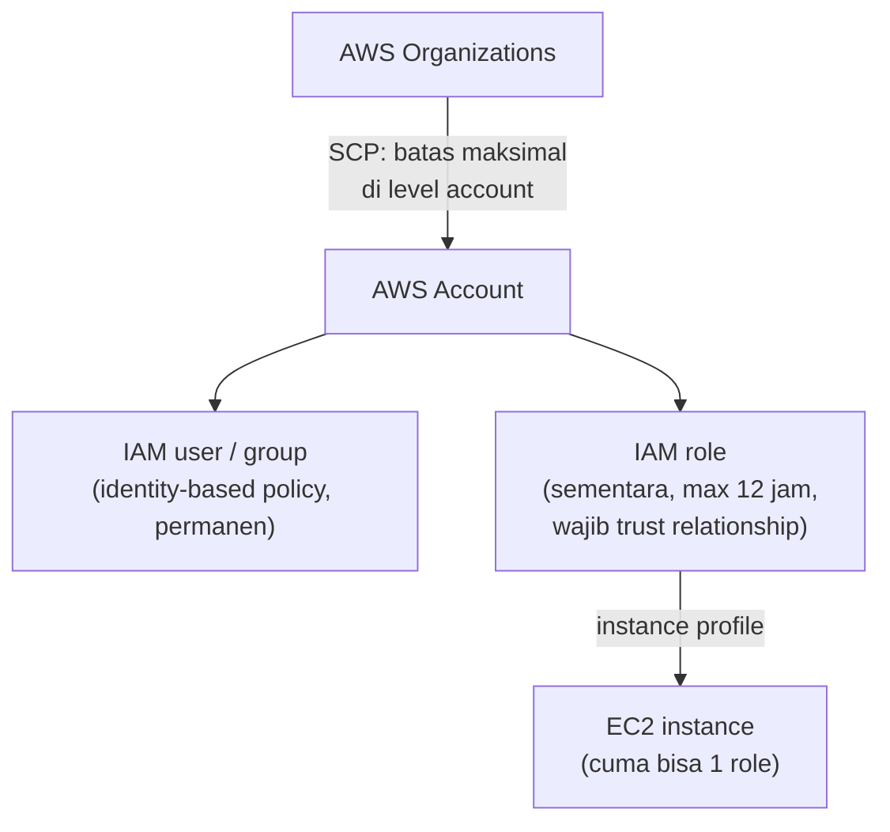

Minggu terakhir re/Start isinya 4 hari mock exam CCP (14 sampai 17 September). Polanya ternyata mirip terus: soalnya nggak susah, yang bikin salah itu **dua service yang mirip** atau **satu kata kecil** di soal yang kelewat. Post ini ngumpulin pasangan-pasangan itu, lanjutan dari [rangkuman konsep CCP](/blog/persiapan-ujian-ccp-rangkuman-konsep) yang udah ada.

## Pasangan Service yang Gampang Ketuker

| Kalau di soal ada... | Jawabannya | Bukan | Kenapa |
|---|---|---|---|
| "dedicated hardware", kunci dipegang sendiri | **CloudHSM** | KMS | KMS kuncinya dikelola AWS, CloudHSM hardware khusus dan kuncinya kita kontrol |
| cuma email (konfirmasi order, reset password) | **SES** | SNS | SNS buat SMS, push notif, pub/sub. Buat email doang, SES lebih murah |
| ngedeteksi ancaman | **GuardDuty** | Detective | Detective itu investigasi **setelah** kejadian |
| data sensitif (PII) di S3 | **Macie** | Inspector | Inspector scan vulnerability di EC2, ECR, Lambda |
| AWS-nya yang lagi bermasalah | **Health Dashboard** | Trusted Advisor | Trusted Advisor ngecek infrastruktur **kita** terhadap best practice |
| aplikasi sederhana, "scalable" | **Elastic Beanstalk** | Lightsail | Lightsail nggak punya auto scaling |
| udah pakai RabbitMQ/ActiveMQ, nggak mau nulis ulang kode | **Amazon MQ** | SQS | pindah ke SQS berarti ganti platform |
| udah pakai Kafka | **MSK** | Kinesis | dua-duanya streaming, MSK itu Kafka managed |
| ETL serverless | **Glue** | EMR | EMR masih ngurus cluster |
| dashboard BI | **QuickSight** | Athena, Redshift | Athena buat query S3, Redshift data warehouse |
| hybrid storage yang seamless | **Storage Gateway** | Direct Connect | Direct Connect itu kabel fiber, mahal dan lama dipasang |
| koneksi konsisten, private | **Direct Connect** | VPN | VPN lewat internet, bandwidth nggak konsisten |
| banyak VPC lintas region plus on-premises | **Transit Gateway** | PrivateLink | PrivateLink cuma satu region dan lebih ke service |
| forecast biaya sebelum pakai | **Pricing Calculator** | Cost Explorer | Cost Explorer buat tagihan yang udah jalan |
| blok IP tertentu | **NACL** | Security group | security group cuma bisa allow (whitelist) |
| patch minor version RDS | **auto minor version upgrade** (RDS) | Systems Manager | Patch Manager buat EC2, RDS itu managed |
| restore RDS ke titik waktu tertentu | **point-in-time recovery** | snapshot | snapshot biasanya harian |
| DR dengan downtime minimal | **Elastic Disaster Recovery** | AWS Backup | Backup bukan spesialis DR |
| cache buat DynamoDB | **DAX** | ElastiCache | DAX khusus DynamoDB |
| share resource antar account | **Resource Access Manager** | Organizations | Organizations buat ngatur account, bukan share resource |
| bikin dan ngatur multi-account otomatis | **Control Tower** | Organizations saja | Control Tower ada di atas Organizations |
| batasi service di "member account" | **SCP** (Organizations) | IAM policy | kata "member" nunjuk ke Organizations |
| lisensi terikat CPU fisik | **Dedicated Host** | Dedicated Instance | Host nyewa server fisiknya, Instance cuma VM-nya |
| infrastruktur pakai bahasa pemrograman | **CDK** | SDK | beda satu huruf, beda fungsi |
| laporan compliance | **AWS Artifact** | CodeArtifact | CodeArtifact itu repository package |
| startup dapet kredit dan support | **AWS Activate** | Marketplace | Marketplace buat beli software |
| IP AWS dipakai nyerang | **Trust and Safety team** | TAM | TAM itu konsultan buat Enterprise support |

## IAM: Role vs Policy vs SCP

- **Policy** biasa nempel ke user dan group, sifatnya permanen.
- **Role** itu sementara (durasi sesi bisa di-set sampai 12 jam), wajib ada **trust relationship** (siapa yang boleh pakai role ini), dan bisa nempel ke resource kayak EC2 lewat **instance profile**.
- **Satu EC2 instance cuma bisa punya satu role.**
- **SCP** itu kayak permission boundary, tapi di level account dalam Organizations.
- **Resource-based policy** nempel ke resource (misal bucket policy), bukan ke identity.

## Harga dan Billing

- **Pay-as-you-go** itu jawaban buat "ngeganti fixed upfront expense". **Economies of scale** itu jawaban buat "kenapa AWS bisa terus nurunin harga" (makin banyak yang pakai, makin murah).
- **Reserved Instance**: Standard diskon sampai 72% tapi spek nggak bisa diubah dan bisa dijual di RI Marketplace. Convertible sampai 66% dan spek bisa diubah.
- **Spot** paling murah tapi bisa di-interrupt, jangan dipilih buat yang harus jalan terus setahun.
- **Yang bisa di-reserve**: EC2, RDS, DynamoDB, Redshift. CloudWatch, S3, Lambda nggak bisa.
- **Billing EC2** nggak dibulatkan ke bawah, Linux dihitung per detik.
- **S3 Standard** nggak kena biaya retrieval. Data masuk ke AWS gratis, keluar bayar.
- **Developer support**: email saja, jam kerja. Telepon 24 jam itu Business ke atas.

## Kata Kecil yang Bikin Salah

- **"across"**: ELB nyebar traffic ke **beda AZ**, bukan beda region. Elastic IP cuma bisa pindah di dalam **satu region**.
- **"private subnet"**: internet gateway itu buat public subnet. Soal yang nyebut private subnet itu jebakan.
- **"scalable"**: langsung coret opsi yang nggak punya auto scaling.
- **"RDS"** di soal shared responsibility: update OS jadi tanggung jawab AWS, karena managed.
- **"customer" vs "AWS"** di soal pricing: "AWS bisa nurunin harga" itu economies of scale, "customer bisa nurunin biaya" itu RI atau Savings Plans.
- **"member"**: berarti Organizations.

## Catatan Kilat dari Buku Catatan Selama Pelatihan

Ini coretan yang aku tulis sendiri selama 7 minggu. Nggak lengkap, tapi justru yang kayak gini yang paling gampang diinget pas ujian:

- **Compliance → AWS Artifact.** Soal yang nyebut laporan compliance atau agreement, jawabannya Artifact.
- **DDoS → AWS Shield.**
- **Egress** = data keluar dari AWS (bayar), **ingress** = data masuk ke AWS (gratis).
- **Pay-as-you-go → public cloud.** Model bayar sesuai pemakaian itu ciri khas public cloud, beda sama on-premises yang modal gede di depan.
- **Transfer learning ≈ fine-tuning.** Di kelas disebut nama lain, lebih tepatnya fine-tuning itu salah satu cara transfer learning: model yang udah dilatih dipakai lagi dan dilatih sedikit buat tugas baru.
- **EDA, feature engineering → Amazon SageMaker Data Wrangler.** EDA (exploratory data analysis, ngulik dan visualisasi data) sama feature engineering (ngolah fitur biar siap dipakai model) itu dua langkah beda, tapi dua-duanya bisa dikerjain di Data Wrangler. Jadi kalau soal AI nyebut salah satunya, kandidat jawabannya Data Wrangler.

## Strategi Ngerjain

- Soal **select 2 / select 3**: benar sebagian tetap dianggap salah total. Flag dan skip dulu, kerjain belakangan.
- Coret dulu opsi yang jelas salah, baru pilih dari sisanya.
- Stamina turun seiring waktu. Ambil jeda (minum, toilet) buat reset konsentrasi, terutama di ujian offline.
- Jawab sendiri, jangan ikut-ikutan jawaban orang (FOMO) pas latihan, biar ketahuan beneran paham atau nggak.

## Yang Perlu Diinget

- Kebanyakan salah itu dari **pasangan service yang mirip**, bukan konsep yang susah.
- Baca kata kunci kecil di soal: across, private, scalable, member, dedicated.
- Hafalin service itu wajib, domain service bobotnya sekitar 34% di ujian.

## Referensi Resmi

- [AWS Certified Cloud Practitioner Exam Guide](https://docs.aws.amazon.com/aws-certification/latest/cloud-practitioner-02/cloud-practitioner-02.html)
- [Amazon EC2 Pricing](https://aws.amazon.com/ec2/pricing/)
- [IAM Roles](https://docs.aws.amazon.com/IAM/latest/UserGuide/id_roles.html)
- [AWS Support Plans](https://aws.amazon.com/premiumsupport/plans/)
