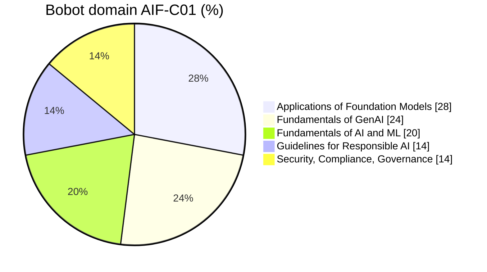
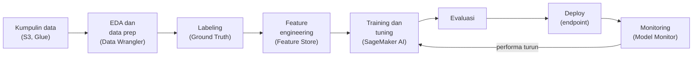

Materi AI di re/Start itu cuma 3 hari teori ([9](/blog/aws-restart-week6-hari-3-materi-ai-hari-pertama), [10](/blog/aws-restart-week6-hari-4-materi-ai-hari-kedua), [11 September](/blog/aws-restart-week6-hari-5-materi-ai-hari-ketiga)), satu sesi [review service AI](/blog/service-ai-aws-wajib-hafal-ccp), dan satu [lab SageMaker](/blog/lab-sagemaker-training-xgboost). Fondasinya udah dapet, tapi ujian **AWS Certified AI Practitioner (AIF-C01)** jauh lebih luas dari itu. Apalagi exam guide-nya diupdate **30 April 2026** (versi 1.1) dan sekarang masuk agentic AI, MCP, Bedrock AgentCore, Kiro, sampe Amazon Quick.

Jadi post ini kerjanya dua: **nyambungin** materi kelas ke tiap task statement exam guide, dan **nambal** yang belum dibahas. Bagian yang nggak ada di kelas aku tandain "tambahan di luar kelas" biar jelas mana yang harus dipelajarin dari nol.

Saran instruktur: **beresin CCP dulu**, baru AI Practitioner. Banyak konsep dasar (IAM, S3, shared responsibility, pricing) kepake di dua-duanya. Pasangan post ini: [rangkuman lengkap re/Start](/blog/rangkuman-aws-restart-ccp-ai-practitioner), [persiapan CCP](/blog/persiapan-lengkap-ujian-aws-cloud-practitioner-clf-c02), dan [kamus service AWS](/blog/kamus-service-aws-fungsi-dan-kegunaannya). Istilah AI kayak token, embedding, RAG, atau fine-tuning ada penjelasan singkatnya di [glosarium](/blog/rangkuman-aws-restart-ccp-ai-practitioner#glosarium-a-sampai-z).

## Kenalan Sama Ujiannya

| | |
|---|---|
| Kode ujian | AIF-C01 (exam guide versi 1.1, 30 April 2026) |
| Jumlah soal | 65 (50 dinilai, 15 nggak dinilai) |
| Tipe soal | multiple choice, multiple response, **ordering** (ngurutin 3-5 langkah), **matching** (jodohin 3-7 pasangan) |
| Durasi | 90 menit |
| Nilai lulus | 700 dari skala 100-1.000 |
| Biaya | $100 |
| Tempat | Pearson VUE, di test center atau online proctored |
| Masa berlaku | 3 tahun |

Soal **ordering** dan **matching** itu yang bikin beda dari CCP: harus bener semua urutannya atau semua pasangannya, baru dapet nilai. Nggak ada nilai setengah.

Kandidat yang dituju exam guide: orang yang **pakai** solusi AI/ML di AWS, belum tentu yang **bikin**. Makanya yang **nggak diuji**: ngoding model, implementasi feature engineering, hyperparameter tuning, bikin pipeline, analisis matematika, implementasi security, dan nyusun framework governance. Yang diuji itu **ngerti konsepnya dan tau service mana yang dipakai**.

Domain 2 dan 3 (generative AI dan foundation model) totalnya 52%. Di sini juga bagian yang paling banyak "tambahan di luar kelas"-nya.

## Domain 1: Fundamentals of AI and ML (20%)

### 1.1 Konsep dan Istilah Dasar

Udah dibahas di kelas:

- Hierarki **AI > ML > deep learning > generative AI > agentic AI**. Deep learning pakai **neural network** berlapis, generative AI pakai **foundation model**.
- **Algoritma** itu cara belajarnya (misal XGBoost), **model** itu hasil training-nya. **Training** itu proses belajar, **inference** itu proses model jawab data baru.
- **Bias**, **fairness**, dan **fit** (overfitting vs underfitting).
- 3 cara belajar: **supervised** (data berlabel), **unsupervised** (tanpa label), **reinforcement** (reward dan punishment).
- Jenis data: **berlabel dan nggak berlabel**, **structured, semi-structured, unstructured**.

Tambahan di luar kelas:

- **Computer vision** (mesin "lihat" gambar dan video) dan **NLP** (natural language processing, mesin ngerti bahasa manusia).
- Jenis data lain yang disebut exam guide: **tabular** (tabel baris-kolom), **time-series** (data berurutan waktu, misal harga saham per jam), **image**, **text**.
- **4 tipe inference** (pola yang sama dipakai di endpoint SageMaker AI):

| Tipe | Cocok buat | Contoh |
|---|---|---|
| **Real-time** | butuh jawaban instan, traffic stabil | deteksi fraud pas transaksi |
| **Batch** | data banyak sekaligus, nggak perlu instan | skoring semua pelanggan tiap malam |
| **Asynchronous** | input gede atau proses lama, hasilnya nyusul | analisa video panjang |
| **Serverless** | traffic jarang atau naik-turun, bayar pas dipakai | chatbot internal yang jarang dipakai |

Baca: [taksonomi AI](/blog/ai-ml-deep-learning-generative-ai-taksonomi), [klasifikasi, regresi, reinforcement](/blog/klasifikasi-regresi-clustering-reinforcement-learning), [3 tipe data](/blog/data-buat-machine-learning-gigo-bias-feature-engineering).

### 1.2 Use Case AI

Udah dibahas di kelas:

- **Kapan nggak pakai ML**: masalahnya bisa diselesain pakai rule biasa atau statistik sederhana, atau biayanya nggak sebanding.
- **Teknik per kebutuhan**: regresi (tebak angka), klasifikasi (tebak kategori), clustering (ngelompokin tanpa label).
- Contoh nyata: computer vision (e-tilang, deteksi masker), fraud detection, speech recognition, knowledge base (chatbot FAQ bank).
- Service AI siap pakai: SageMaker AI, Transcribe, Comprehend, Lex, Polly, plus Textract dan Rekognition.

Tambahan di luar kelas:

- AI juga **nggak cocok** kalau yang dibutuhin itu **hasil pasti**, bukan prediksi. Contoh: ngitung pajak itu pakai rumus, bukan model.
- **Amazon Translate**: terjemahan otomatis antar bahasa.
- **ML tradisional vs foundation model**: pilih ML tradisional kalau regulasinya ketat, hasilnya harus bisa dijelasin (explainability), datanya tabular, atau butuh latency dan biaya rendah. Pilih foundation model kalau tugasnya terbuka dan berbasis bahasa (ngerangkum, ngobrol, bikin konten) atau butuh satu model buat banyak tugas.

Baca: [kapan pakai ML](/blog/data-buat-machine-learning-gigo-bias-feature-engineering), [service AI wajib hafal](/blog/service-ai-aws-wajib-hafal-ccp), [framework 4 pertanyaan](/blog/framework-4-pertanyaan-adopsi-ai-perusahaan).

### 1.3 Lifecycle AI/ML

Udah dibahas di kelas: data prep makan waktu paling banyak, split data training/validasi/test, training job di SageMaker, notebook instance, deploy ke endpoint, dan **continuous training** biar model nggak ketinggalan zaman.

Tambahan di luar kelas, **pipeline ML lengkap** plus service AWS di tiap tahap:

- **Sumber foundation model**: model open source yang udah di-pretrain (misal lewat SageMaker JumpStart), model proprietary lewat API (Bedrock), atau training model sendiri dari nol.
- **Cara pakai model di produksi**: **managed API** (Bedrock, bayar per token, nggak ngurus server) vs **self-hosted** (SageMaker endpoint atau EC2, kontrol penuh tapi ngurus infrastruktur).
- Service yang disebut exam guide buat pipeline AI: **Bedrock**, **SageMaker AI**, **Amazon Q**, **Amazon Quick**, **Kiro**. Detailnya di bagian [service AI wajib hafal](#service-ai-yang-wajib-hafal) di bawah.
- **MLOps**: eksperimen yang tercatat, proses yang bisa diulang, sistem yang bisa scale, ngurangin technical debt, siap produksi, **monitoring model**, dan **retraining** kalau performanya turun.

**Metrik model** (confusion matrix udah disinggung instruktur di kelas, sisanya tambahan):

| | Diprediksi positif | Diprediksi negatif |
|---|---|---|
| **Aslinya positif** | TP (true positive) | FN (false negative) |
| **Aslinya negatif** | FP (false positive) | TN (true negative) |

- **Accuracy**: berapa persen tebakan yang bener dari semua data. Bisa nipu kalau datanya nggak seimbang.
- **Precision** = TP ÷ (TP + FP): dari yang ditebak positif, berapa yang beneran positif. Penting kalau **false positive mahal** (email penting masuk spam).
- **Recall** = TP ÷ (TP + FN): dari yang aslinya positif, berapa yang ketangkep. Penting kalau **false negative berbahaya** (penyakit atau fraud yang lolos).
- **F1 score**: gabungan precision dan recall, dipakai kalau dua-duanya sama penting.
- **AUC**: dipakai di lab SageMaker. 0,5 itu tebak-tebakan, makin deket 1 makin bagus.
- **Metrik bisnis**: cost per user, biaya development, feedback pelanggan, **ROI**.

Baca: [lab SageMaker](/blog/lab-sagemaker-training-xgboost), [data labeling](/blog/data-labeling-object-detection-image-segmentation), [knowledge cut-off dan CT](/blog/ai-ml-deep-learning-generative-ai-taksonomi).

## Domain 2: Fundamentals of GenAI (24%)

### 2.1 Konsep Dasar Generative AI

Udah dibahas di kelas: **token**, **embedding**, **vector**, **prompt engineering** (sekarang disebut context engineering), **transformer**, **foundation model**, **multimodal**, **diffusion model**, **token billing** (input dan output dibayar), dan pola multi-agent **LLM supervisor**.

Tambahan di luar kelas:

- **Chunking**: dokumen panjang dipotong jadi bagian kecil sebelum di-embedding, biar pencarian di RAG lebih presisi.
- **Use case generative AI**: bikin gambar, video, audio, ringkasan, asisten AI, terjemahan, generate kode, agent customer service, search, rekomendasi.
- **Lifecycle foundation model**: pilih data → pilih model → pre-training → fine-tuning → evaluasi → deploy → feedback.
- **Token pricing**: output biasanya lebih mahal dari input. Jawaban panjang dan reasoning model bikin token boros, jadi biaya dan latency naik.
- **Agentic AI**, konsep yang sekarang masuk ujian:

| Konsep | Artinya |
|---|---|
| **Agent** | LLM yang bisa ngerencanain langkah, pakai **tools** (API, database, fungsi), dan ambil aksi |
| **MCP (Model Context Protocol)** | protokol standar terbuka buat nyambungin agent ke tools dan sumber data luar, kayak "colokan USB" buat AI |
| **Multi-agent pattern** | beberapa agent spesialis kerja bareng, misal satu supervisor ngebagi tugas ke agent lain |
| **Memory** | ingatan jangka pendek (dalam satu sesi) dan jangka panjang (lintas sesi) |
| **Tool usage** | agent milih dan manggil tools yang pas buat tugasnya |
| **Workflow orchestration** | ngatur urutan langkah dan aliran data antar agent atau tools |

Baca: [vector database dan RAG](/blog/vector-database-rag-embedding), [arsitektur LLM](/blog/arsitektur-llm-transformer-base-instruct-reasoning-model), [LLM supervisor](/blog/ukuran-model-vs-kepintaran-ai-spesialisasi), [token billing](/blog/biaya-deploy-ai-token-billing-spek-infra).

### 2.2 Kelebihan dan Keterbatasan Generative AI

Udah dibahas di kelas: **halusinasi** dan **knowledge cut-off**, model besar belum tentu lebih pintar, dan trade-off ukuran, biaya, kecepatan.

Tambahan di luar kelas:

- **Kelebihan**: adaptif, responsif, bisa ngobrol natural, bisa bikin konten baru.
- **Kekurangan**: halusinasi, susah dijelasin cara mikirnya (**interpretability**), kurang akurat, dan **nondeterministic** (prompt sama bisa dapet jawaban beda).
- **Faktor milih model**: tipe dan modality model, kebutuhan performa, kemampuan, batasan, compliance, **biaya**, **latency**, kompleksitas.
- **Metrik bisnis generative AI**: performa lintas domain, ROI, efisiensi, **conversion rate**, **ARPU** (average revenue per user), akurasi, **CLV** (customer lifetime value).

Baca: [ukuran model vs kepintaran](/blog/ukuran-model-vs-kepintaran-ai-spesialisasi).

### 2.3 Infrastruktur AWS buat Generative AI

Udah dibahas di kelas: **Bedrock** (foundation model siap pakai), **SageMaker AI** dan **JumpStart**, chip **Trainium** (training) dan **Inferentia** (inference).

Tambahan di luar kelas, service yang baru masuk exam guide 1.1:

| Service | Artinya |
|---|---|
| **Amazon Nova** | keluarga foundation model buatan Amazon sendiri, tersedia di Bedrock |
| **Bedrock AgentCore** | platform buat deploy dan ngoperasiin agent di produksi dengan aman: runtime, memory, gateway ke tools (termasuk MCP), identity, observability. Bisa pakai framework dan model apa aja |
| **Strands Agents** | SDK open source (Python dan TypeScript) buat bikin agent. Cukup kasih prompt dan daftar tools, LLM yang ngerencanain langkahnya |
| **Kiro** | IDE agentic dari AWS dengan pendekatan **spec-driven development**: requirement, desain, dan daftar task ditulis dulu sebelum kode |
| **Amazon Q** | asisten generative AI, misal buat developer dan kerjaan di AWS |
| **Amazon Quick** | workspace AI buat kerjaan kantor: Quick Sight (BI), Quick Research (riset), Quick Flows dan Quick Automate (otomasi), semua lewat satu chat |
| **AWS Transform** | agentic AI buat migrasi dan modernisasi aplikasi lama |

- **Kelebihan pakai service generative AI AWS**: gampang diakses, barrier masuk rendah, efisien, hemat biaya, cepat sampe pasar.
- **Kelebihan infrastruktur AWS**: keamanan, compliance, tanggung jawab (shared responsibility), keselamatan.
- **Trade-off biaya**: bayar **on-demand per token** (fleksibel) vs **provisioned throughput** (sewa kapasitas per jam, throughput terjamin, dibutuhin buat model custom), plus faktor latency, availability, redundansi, dan cakupan region (nggak semua model ada di semua region).

Baca: [SageMaker AI vs Bedrock](/blog/service-ai-aws-wajib-hafal-ccp), [Trainium dan Inferentia](/blog/ukuran-model-vs-kepintaran-ai-spesialisasi).

## Domain 3: Applications of Foundation Models (28%)

Domain paling gede. Fokusnya: gimana milih, nyesuain, dan ngevaluasi foundation model.

### 3.1 Desain Aplikasi Berbasis Foundation Model

Udah dibahas di kelas: parameter **temperature, top-p, top-k**, **RAG**, **vector database**, dan 3 cara kustomisasi (prompt engineering, RAG, fine-tuning).

Tambahan di luar kelas:

- **Kriteria milih model**: biaya, modality, latency, dukungan multibahasa, ukuran, kompleksitas, bisa dikustomisasi atau nggak, panjang input/output (context window), dan **prompt caching** (bagian prompt yang sama dipakai berulang disimpan, jadi lebih murah dan cepat).
- **Parameter inference lain**: **max tokens** (batas panjang output) dan **stop sequence** (kata yang bikin model berhenti).
- **Bedrock Knowledge Bases**: RAG versi managed. Dokumen dari S3 otomatis di-chunk, di-embedding, disimpan di vector database, terus dipakai buat jawab.
- **Vector database di AWS** menurut exam guide: **OpenSearch Service**, **Aurora** (PostgreSQL dengan pgvector), **RDS for PostgreSQL** (pgvector), dan **Neptune**. Di kelas sempet disebut DynamoDB dan Elasticsearch, tapi buat ujian pegang daftar resmi ini.
- **Trade-off biaya kustomisasi**, dari paling murah ke paling mahal:

| Cara | Ngubah bobot model? | Biaya | Kapan |
|---|---|---|---|
| **In-context learning / prompt engineering** | nggak | paling murah | contoh dan instruksi di prompt udah cukup |
| **RAG** | nggak | rendah-sedang | butuh data privat atau terbaru, harus bisa nunjukin sumber |
| **Fine-tuning** | ya | sedang-tinggi | butuh gaya atau keahlian spesifik, ada data berlabel |
| **Continued pre-training** | ya | tinggi | butuh model ngerti domain tertentu, pakai banyak data nggak berlabel |
| **Pre-training dari nol** | model baru | paling mahal | hampir nggak pernah jadi jawaban yang bener buat perusahaan biasa |
| **Model distillation** | model kecil baru | ngurangin biaya inference | model besar ("guru") ngajarin model kecil ("murid") biar lebih murah dan cepat |

- **AI agent**: dipakai buat tugas banyak langkah kayak customer service yang ngecek status order, booking perjalanan, atau otomasi operasional IT.

Baca: [RAG](/blog/vector-database-rag-embedding), [parameter inference](/blog/arsitektur-llm-transformer-base-instruct-reasoning-model).

### 3.2 Prompt Engineering

Udah dibahas di kelas: system prompt ngatur perilaku model, **context engineering**, dan bahaya **prompt hijacking**.

Tambahan di luar kelas:

- **Komponen prompt**: **instruksi** (apa yang harus dikerjain), **konteks** (info latar), **input data**, **format output**, dan **negative prompt** (apa yang **nggak** boleh dilakuin atau dimunculin).
- **Teknik**:

| Teknik | Artinya |
|---|---|
| **Zero-shot** | langsung minta tanpa contoh |
| **Single-shot / one-shot** | kasih 1 contoh |
| **Few-shot** | kasih beberapa contoh |
| **Chain-of-thought** | minta model mikir langkah demi langkah sebelum jawab |
| **Prompt template** | kerangka prompt yang bisa dipakai ulang dengan isian berbeda |

- **Best practice**: spesifik dan ringkas, eksperimen, pasang guardrail, pecah tugas besar jadi beberapa langkah.
- **Risiko**:

| Risiko | Artinya |
|---|---|
| **Prompt injection / hijacking** | instruksi jahat diselipin ke input biar model ngelanggar aturan aslinya |
| **Jailbreaking** | ngebujuk model biar ngelewatin batasan keamanannya |
| **Poisoning** | data training atau dokumen sumber "diracun" biar output-nya ngaco |
| **Exposure** | model bocorin data sensitif atau isi system prompt |

- **Bedrock Prompt Management**: nyimpen, ngasih versi, ngetes, dan pakai ulang prompt.

Baca: [responsible AI dan prompt injection](/blog/responsible-ai-guardrails-prompt-injection), [context engineering](/blog/arsitektur-llm-transformer-base-instruct-reasoning-model).

### 3.3 Training dan Fine-Tuning Foundation Model

Udah dibahas di kelas: base, instruct, dan reasoning model, fine-tuning ngubah bobot model, **transfer learning** (fine-tuning itu salah satu caranya), dan instruktur sempet nyinggung **QLoRA** (fine-tuning hemat memori).

Tambahan di luar kelas:

- **Pre-training**: belajar dari data raksasa nggak berlabel. **Fine-tuning**: dilatih lagi pakai data berlabel buat tugas spesifik. **Continued pre-training**: dilatih lagi pakai data domain nggak berlabel. **Distillation**: model kecil belajar dari model besar.
- **Metode fine-tuning**: **instruction tuning** (pakai pasangan instruksi dan jawaban, ini yang bikin base model jadi instruct model), adaptasi domain, transfer learning, continued pre-training.
- **Nyiapin data fine-tuning**: dikurasi, ada governance-nya, ukurannya cukup, labelnya bener, **representatif**.
- **RLHF** (reinforcement learning from human feedback): manusia menilai jawaban model, penilaian itu dipakai buat ngajarin model jawab lebih baik.

Baca: [arsitektur LLM](/blog/arsitektur-llm-transformer-base-instruct-reasoning-model), [journal minggu 7](/blog/aws-restart-week7-hari-1-service-ai-lab-sagemaker).

### 3.4 Evaluasi Foundation Model

Udah dibahas di kelas: **LLM as a judge** di Bedrock dan **RAGAS** buat evaluasi RAG.

Tambahan di luar kelas:

- **Cara evaluasi**: **human-in-the-loop** (manusia menilai), **benchmark dataset** (soal standar), dan **Bedrock Model Evaluation** (otomatis, pakai manusia, atau pakai LLM as a judge).
- **Metrik**:

| Metrik | Buat | Cara kerja singkat |
|---|---|---|
| **ROUGE** | ringkasan | seberapa banyak kata di ringkasan referensi yang muncul di hasil model |
| **BLEU** | terjemahan | seberapa mirip hasil terjemahan dengan terjemahan referensi |
| **BERTScore** | kemiripan makna | bandingin makna pakai embedding, bukan cuma kata yang sama persis |
| **LLM-as-a-judge** | penilaian umum | LLM lain menilai kualitas jawaban |

- **Evaluasi aplikasi**: RAG dinilai dari relevansi dokumen yang diambil dan seberapa setia jawabannya ke dokumen itu. Agent dan workflow dinilai dari tugasnya beres atau nggak.
- **Metrik keselarasan bisnis**: **task completion rate**, kepuasan user, **cost per interaction**, produktivitas, engagement.

Baca: [fitur Bedrock yang disebut](/blog/service-ai-aws-wajib-hafal-ccp).

## Domain 4: Guidelines for Responsible AI (14%)

### 4.1 Membangun AI yang Bertanggung Jawab

Udah dibahas di kelas: prinsip **akurat, adil, aman, explainable, bisa dikontrol**, **guardrail** (filter kategori konten, topik terlarang, kata terlarang, PII), contoh pengacara yang dikasih kutipan hukum palsu, data **bias/imbalanced**, dan overfitting vs underfitting.

Tambahan di luar kelas:

- Fitur responsible AI versi exam guide: **bias, fairness, inclusivity, robustness, safety, veracity** (jawabannya bener dan bisa dipercaya).
- **Bedrock Guardrails** juga punya **contextual grounding check**, ngecek apakah jawaban model nyambung ke dokumen sumber, buat nangkep halusinasi.
- **Milih model yang bertanggung jawab**: pertimbangin dampak lingkungan. Model lebih kecil yang cukup buat tugasnya itu lebih hemat energi.
- **Risiko hukum generative AI**: klaim pelanggaran hak cipta (IP), output yang bias, hilangnya kepercayaan pelanggan, risiko buat end user, halusinasi.
- **Karakteristik dataset yang baik**: inklusif, beragam, sumbernya dikurasi, seimbang.
- **Bias vs variance**: bias tinggi bikin **underfitting**, variance tinggi bikin **overfitting**. Dua-duanya bisa ngerugiin kelompok demografis tertentu.
- **Tools deteksi bias**: analisa kualitas label, audit manusia, **analisa per subgrup** (cek performa model per kelompok, misal per gender atau umur). Di AWS ada **SageMaker Clarify** (deteksi bias dan penjelasan prediksi) dan **SageMaker Model Monitor** (pantau drift di produksi).

Baca: [responsible AI](/blog/responsible-ai-guardrails-prompt-injection), [GIGO dan bias](/blog/data-buat-machine-learning-gigo-bias-feature-engineering), [overfitting vs underfitting](/blog/lab-sagemaker-training-xgboost).

### 4.2 Transparansi dan Explainability

Semuanya tambahan di luar kelas:

- **Model transparan**: alasan keputusannya bisa dijelasin (misal decision tree atau regresi linear). **Model black box**: susah dijelasin (neural network dalam, LLM).
- **Tools**: **SageMaker Model Cards** (dokumentasi model: tujuan, data, performa, risiko), **SageMaker Clarify** (fitur mana yang paling ngaruh ke prediksi), **Bedrock Model Evaluations**, model open source (bobot dan datanya bisa dicek), dan lisensi.
- **Trade-off**: model yang makin kompleks biasanya makin akurat tapi makin susah dijelasin. Keamanan dan transparansi juga kadang tarik-menarik.
- **Human-centered design**: sediain mekanisme feedback dari user, dan transparan soal keputusan AI (kasih tau user kalau lagi ngobrol sama AI, tunjukin alasan atau sumbernya).

## Domain 5: Security, Compliance, and Governance (14%)

### 5.1 Mengamankan Sistem AI

Udah dibahas di kelas: jangan paste kredensial ke AI, prompt injection, guardrail, dan fondasi IAM, KMS, shared responsibility dari materi CCP.

Tambahan di luar kelas:

| Kebutuhan | Service / fitur |
|---|---|
| Atur siapa boleh pakai model dan data | IAM role, policy, permission |
| Enkripsi data training dan hasil | KMS, enkripsi at rest dan in transit |
| Cari PII di data training di S3 | Macie |
| Akses Bedrock tanpa lewat internet publik | PrivateLink (VPC endpoint) |
| Identity dan akses agent ke tools | Bedrock **AgentCore Identity** |
| Batasin aksi yang boleh dilakuin agent | **Policy in AgentCore** |
| Filter input dan output berbahaya | Bedrock Guardrails |
| Log siapa manggil model | CloudTrail |

- **Shared responsibility buat AI**: AWS ngamanin infrastruktur dan service-nya, customer ngamanin data, prompt, akses, dan aplikasinya.
- **Asal-usul data**: **data lineage** (jejak data dari mana ke mana), **data cataloging** (katalog data, misal Glue Data Catalog), **SageMaker Model Cards**, dan **source citation** (jawaban nunjukin sumbernya).
- **Data engineering yang aman**: cek kualitas data, **privacy-enhancing technology** (anonimisasi, masking), kontrol akses data, integritas data.
- **Pertimbangan keamanan AI**: keamanan aplikasi, deteksi ancaman, manajemen kerentanan, proteksi infrastruktur, prompt injection, enkripsi, **pencegahan kebocoran data**, **filter dan validasi output**, **audit trail** interaksi AI, dan **toxicity**.
- **Deteksi halusinasi dan grounding**: **RAG grounding** (jawaban dipaksa berdasarkan dokumen), **validasi output**, **confidence scoring**, dan contextual grounding check di Guardrails.

> Di kelas dibahas kalau nanya ke aplikasi chat AI publik, datanya bisa dipakai buat training. Itu berlaku buat aplikasi konsumen. Di **Bedrock**, penyedia model nggak punya akses ke prompt dan output customer, dan retensi datanya bisa diatur customer sendiri. Makanya perusahaan yang datanya sensitif lebih aman bikin aplikasi di atas Bedrock daripada nyuruh karyawan pakai chat AI publik.
{: .prompt-info }

Baca: [responsible AI dan prompt injection](/blog/responsible-ai-guardrails-prompt-injection), [IAM](/blog/iam-policy-permission-role), [KMS](/blog/kms-encrypt-decrypt-symmetric-key).

### 5.2 Governance dan Compliance AI

Tambahan di luar kelas (service-nya udah kenal dari CCP, konteksnya yang baru):

- **Service governance**: **AWS Config** (konfigurasi sesuai aturan), **Inspector** (kerentanan), **Artifact** (laporan compliance), **CloudTrail** (audit), **Trusted Advisor** (best practice).
- **Strategi data governance**: lifecycle data, logging, **residency** (data disimpan di negara mana), monitoring, observasi, **retensi**.
- **Proses governance**: kebijakan, jadwal review rutin, strategi review, standar transparansi, training tim.
- **Generative AI Security Scoping Matrix**, framework AWS buat nentuin level kontrol keamanan:

| Scope | Artinya | Contoh |
|---|---|---|
| **1. Consumer app** | pakai aplikasi AI publik | karyawan pakai chat AI publik |
| **2. Enterprise app** | pakai software perusahaan yang ada fitur AI-nya | aplikasi SaaS dengan fitur AI |
| **3. Pre-trained model** | bikin aplikasi sendiri di atas foundation model | chatbot pakai model di Bedrock |
| **4. Fine-tuned model** | fine-tuning foundation model pakai data sendiri | model custom di Bedrock |
| **5. Self-trained model** | training model dari nol | model sendiri di SageMaker AI |

Makin besar nomor scope-nya, makin banyak tanggung jawab keamanan yang dipegang sendiri.

Baca: [CloudTrail, Config](/blog/cloudwatch-logs-events-eventbridge), [Artifact dan Inspector](/blog/jebakan-soal-ccp-mock-exam-week-7).

## Service AI yang Wajib Hafal

Semua service Machine Learning yang in-scope, plus fitur-fitur yang sering muncul:

| Service / fitur | Buat apa | Kata kunci di soal |
|---|---|---|
| **Bedrock** | akses foundation model lewat API, serverless | generative AI tanpa ngurus infrastruktur |
| Bedrock Knowledge Bases | RAG managed | "pakai dokumen perusahaan", jawaban plus sumber |
| Bedrock Agents / AgentCore | bikin dan jalanin agent | tugas banyak langkah, pakai tools |
| Bedrock Guardrails | filter konten, PII, topik, grounding | keamanan output, responsible AI |
| Bedrock Model Evaluation | evaluasi dan bandingin model | milih model terbaik |
| Bedrock Prompt Management | versi dan kelola prompt | prompt versioning |
| Provisioned Throughput | kapasitas model yang dipesan | throughput terjamin, model custom |
| **Amazon Nova** | foundation model buatan Amazon | model Amazon di Bedrock |
| **SageMaker AI** | platform ML end-to-end | bikin, training, deploy model sendiri |
| SageMaker JumpStart | hub model pre-trained dan foundation model | "model siap pakai di SageMaker" |
| SageMaker Ground Truth | labeling data, bisa pakai manusia | anotasi, data berlabel |
| SageMaker Data Wrangler | EDA dan feature engineering | nyiapin data |
| SageMaker Feature Store | nyimpen dan share fitur | fitur dipakai ulang |
| SageMaker Clarify | deteksi bias dan explainability | bias, fitur paling berpengaruh |
| SageMaker Model Monitor | pantau model di produksi | drift, kualitas turun |
| SageMaker Model Cards | dokumentasi model | transparansi, governance |
| SageMaker Canvas | ML tanpa ngoding | analis bisnis, no-code |
| **Comprehend** | analisa teks | sentiment, entitas, PII |
| **Lex** | chatbot | percakapan, voice bot |
| **Polly** | teks → suara | text to speech |
| **Transcribe** | suara → teks | speech to text, subtitle |
| **Translate** | terjemahan | multibahasa |
| **Textract** | ambil teks dan tabel dari dokumen | scan, formulir, struk |
| **Rekognition** | analisa gambar dan video | deteksi wajah, objek, konten nggak pantas |
| **Personalize** | sistem rekomendasi | "produk yang mungkin kamu suka" |
| **AWS Transform** | modernisasi aplikasi pakai agentic AI | migrasi aplikasi lama |
| **Kiro** | IDE agentic | spec-driven development |
| **Strands Agents** | SDK bikin agent | open source, model-driven |
| **Amazon Q** | asisten generative AI | asisten AI di AWS |
| **Amazon Quick** | workspace AI bisnis | BI, riset, otomasi kerjaan |

Service non-ML yang juga in-scope, cukup tau fungsinya: **Glue** (ETL), **Glue DataBrew** (nyiapin data tanpa ngoding), **Lake Formation** (bikin dan ngatur akses data lake), **EMR** (big data), **OpenSearch Service** (search dan vector), **Redshift** (data warehouse), **Data Exchange** (data pihak ketiga), **DocumentDB**, **Neptune**, **ElastiCache**, **Secrets Manager**, dan **Well-Architected Tool**. Sisanya (EC2, Lambda, S3, IAM, KMS, CloudTrail, Config, VPC, CloudFront, Budgets, Cost Explorer) udah dibahas di [rangkuman](/blog/rangkuman-aws-restart-ccp-ai-practitioner).

## Seberapa Jauh Materi Kelas Nutupin Ujian

| Domain | Udah kuat dari kelas | PR yang harus dipelajarin |
|---|---|---|
| 1. Fundamentals of AI and ML | taksonomi, tipe learning, data, overfitting, lab SageMaker | tipe inference, pipeline dan MLOps, precision/recall/F1, ML tradisional vs FM |
| 2. Fundamentals of GenAI | token, embedding, transformer, token billing, supervisor agent | agentic AI dan MCP, lifecycle FM, service baru (Nova, AgentCore, Kiro, Strands, Quick, Transform) |
| 3. Applications of FM | RAG, parameter inference, 3 cara kustomisasi | teknik prompt, risiko prompt, urutan biaya kustomisasi, ROUGE/BLEU/BERTScore, Knowledge Bases |
| 4. Responsible AI | prinsip, guardrail, bias data | Clarify, Model Cards, transparansi vs black box, risiko hukum |
| 5. Security dan Governance | IAM, KMS, shared responsibility (dari CCP) | Macie, PrivateLink, AgentCore Identity, Scoping Matrix, data lineage |

## Rencana Belajar 14 Hari (Setelah CCP)

| Hari | Fokus |
|---|---|
| 1 | Baca ulang semua post AI re/Start: [taksonomi](/blog/ai-ml-deep-learning-generative-ai-taksonomi), [data](/blog/data-buat-machine-learning-gigo-bias-feature-engineering), [RAG](/blog/vector-database-rag-embedding), [LLM](/blog/arsitektur-llm-transformer-base-instruct-reasoning-model), [responsible AI](/blog/responsible-ai-guardrails-prompt-injection) |
| 2-3 | Domain 1: tipe inference, pipeline, metrik (latihan ngitung precision dan recall dari confusion matrix) |
| 4-5 | Domain 2: agentic AI, MCP, service generative AI baru |
| 6-8 | Domain 3: teknik prompt, urutan biaya kustomisasi, metrik evaluasi, Knowledge Bases |
| 9 | Domain 4 dan 5: Clarify, Model Cards, Guardrails, Macie, PrivateLink, Scoping Matrix |
| 10 | Hafalin tabel "Service AI yang wajib hafal" di atas |
| 11-12 | Latihan soal, bahas yang salah |
| 13 | Latihan soal kedua, fokus di soal ordering dan matching |
| 14 | Review tabel dan istilah, tidur cukup |

Sumber latihan: instruktur sempet bagiin 20 soal latihan AI Practitioner gratis. Di **AWS Skill Builder** cari "AIF-C01", ada exam prep course dan official practice question set yang gratis.

## Strategi Ngerjain Soal

- **Soal skenario**: cari kata kunci kebutuhannya dulu. "Pakai dokumen internal" → RAG / Knowledge Bases. "Tanpa training" → prompt engineering atau RAG. "Gaya bahasa perusahaan" → fine-tuning. "Model lebih murah dan cepat" → model lebih kecil atau distillation.
- **Soal ordering**: bayangin pipeline-nya dari awal (data → training → evaluasi → deploy → monitoring), jangan ngapalin urutan.
- **Soal matching**: kerjain pasangan yang paling yakin dulu, sisanya jadi lebih gampang dieliminasi.
- **Bedrock vs SageMaker AI**: foundation model siap pakai → Bedrock. Bikin atau training model sendiri → SageMaker AI.
- Strategi umum dari [persiapan CCP](/blog/persiapan-lengkap-ujian-aws-cloud-practitioner-clf-c02) tetep berlaku: flag, skip, jangan kosongin jawaban.

## Yang Perlu Diinget

- AIF-C01 punya soal **ordering** dan **matching**, harus bener semua biar dapet nilai.
- Exam guide versi 1.1 (30 April 2026) masukin agentic AI, MCP, AgentCore, Kiro, Strands, Amazon Quick, Nova, dan AWS Transform. Semuanya nggak dibahas di kelas.
- Urutan biaya kustomisasi: prompt engineering < RAG < fine-tuning < continued pre-training < pre-training dari nol.
- Precision penting kalau false positive mahal, recall penting kalau false negative berbahaya.
- ROUGE buat ringkasan, BLEU buat terjemahan, BERTScore buat kemiripan makna.
- Clarify buat bias dan explainability, Model Cards buat dokumentasi, Guardrails buat filter dan grounding, Macie buat PII di S3.

## Referensi Resmi

- [AWS Certified AI Practitioner (AIF-C01) Exam Guide](https://docs.aws.amazon.com/aws-certification/latest/ai-practitioner-01/ai-practitioner-01.html)
- [AIF-C01 Exam Guide Revisions](https://docs.aws.amazon.com/aws-certification/latest/ai-practitioner-01/aif-01-revisions.html)
- [In-Scope AWS Services AIF-C01](https://docs.aws.amazon.com/aws-certification/latest/ai-practitioner-01/aif-01-in-scope-services.html)
- [Amazon Bedrock Data Protection](https://docs.aws.amazon.com/bedrock/latest/userguide/data-protection.html)
- [Amazon Bedrock AgentCore](https://aws.amazon.com/bedrock/agentcore/)
- [Generative AI Security Scoping Matrix](https://aws.amazon.com/ai/generative-ai/security/scoping-matrix/)
- [Responsible AI at AWS](https://aws.amazon.com/ai/responsible-ai/)
