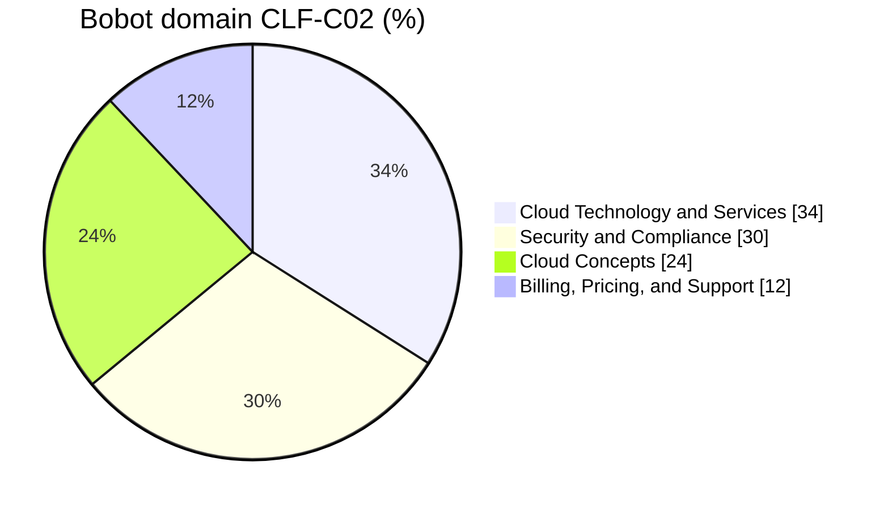

Voucher ujian dari re/Start udah di tangan, dan pesan instruktur jelas: **langsung ujian secepat mungkin**, jangan ditunda sampe lupa atau voucher-nya keburu nggak bisa dipakai. Post ini peta belajarnya.

Bedanya sama [rangkuman lengkap re/Start](/blog/rangkuman-aws-restart-ccp-ai-practitioner): rangkuman itu disusun per kategori service (apa yang dipelajari), sedangkan post ini disusun ngikutin **exam guide resmi CLF-C02**, per domain dan per task statement (apa yang diuji). Tiap poin ada link ke post aslinya kalau mau baca detail. Materi yang ada di exam guide tapi **nggak dibahas di kelas** juga aku tulis, biar nggak kaget pas ujian.

Pasangannya: [post jebakan soal dari 4 hari mock exam](/blog/jebakan-soal-ccp-mock-exam-week-7) dan [rangkuman konsep CCP](/blog/persiapan-ujian-ccp-rangkuman-konsep).

## Kenalan Sama Ujiannya

| | |
|---|---|
| Kode ujian | CLF-C02 |
| Jumlah soal | 65 (50 dinilai, 15 nggak dinilai dan nggak ditandain yang mana) |
| Tipe soal | multiple choice (1 jawaban benar) dan multiple response (2 atau lebih jawaban benar) |
| Durasi | 90 menit (bisa minta tambahan 30 menit buat yang bahasa ibunya bukan bahasa Inggris, diajuin sebelum booking) |
| Nilai lulus | 700 dari skala 100-1.000 |
| Biaya | $100 (di Indonesia kena pajak sekitar 11%, totalnya kurang lebih Rp2 juta), gratis kalau pakai voucher re/Start |
| Tempat | Pearson VUE, di test center atau online proctored |
| Masa berlaku | 3 tahun |

Beberapa hal penting dari exam guide:

- **Nggak ada penalti buat jawaban salah.** Soal yang nggak dijawab otomatis salah, jadi jangan ada yang dikosongin.
- **Scoring-nya compensatory**: nggak perlu lulus di tiap domain, yang penting total nilainya lewat 700.
- Soal **multiple response** harus bener semua jawabannya. Bener satu dari dua tetep dianggap salah total.
- Yang **nggak** diuji: ngoding, desain arsitektur, troubleshooting, implementasi, load testing. CCP itu soal **ngenalin** konsep dan service, bukan ngerjain.

Dua domain terbesar (service dan security) udah 64%. Jadi kalau waktunya mepet, prioritasin dua itu.

## Domain 1: Cloud Concepts (24%)

### 1.1 Benefit AWS Cloud

Yang harus bisa dijawab:

- 6 keuntungan cloud, terutama bedanya **trade fixed expense for variable expense** (ganti modal di depan) dan **economies of scale** (kenapa AWS bisa terus nurunin harga).
- Benefit **global infrastructure**: deploy cepat, jangkauan global dalam menit.
- Bedanya **high availability** (tetep jalan walau ada yang rusak), **elasticity** (resource naik-turun otomatis sesuai beban), dan **agility** (bisa eksperimen dan rilis lebih cepat karena resource siap dalam menit).

Baca: [keuntungan cloud](/blog/keuntungan-cloud-computing), [service model dan scaling](/blog/cloud-computing-service-model-scaling), [ELB dan HA vs FT](/blog/elastic-load-balancing-elb).

### 1.2 Design Principle dan Well-Architected

Yang harus bisa dijawab:

- Hafal **6 pilar**: operational excellence, security, reliability, performance efficiency, cost optimization, sustainability.
- Bisa **bedain** pilar dari contoh kasus. Multi-AZ itu reliability, IaC itu operational excellence, rightsizing itu cost optimization, pilih tipe instance yang pas itu performance efficiency, maksimalin utilisasi itu sustainability.
- Design principle umum: stop guessing capacity, test at production scale, automate, game days.

Baca: [Well-Architected Framework](/blog/aws-well-architected-framework), [rangkuman: tabel 6 pilar](/blog/rangkuman-aws-restart-ccp-ai-practitioner).

### 1.3 Migrasi ke Cloud

Yang harus bisa dijawab:

- **CAF**: 6 perspektif (business, people, governance, platform, security, operations) dan siapa stakeholder-nya.
- Benefit CAF menurut exam guide: **risiko bisnis turun, performa ESG naik, pendapatan naik, efisiensi operasional naik**.
- Tools migrasi database: **DMS** (source tetep jalan selama migrasi, pakai CDC) dan **SCT** (konversi skema kalau engine-nya beda).

Tambahan di luar kelas, **strategi migrasi 7R**:

| Strategi | Artinya | Contoh |
|---|---|---|
| **Retire** | matiin, udah nggak dipakai | aplikasi lama yang nggak ada user-nya |
| **Retain** | biarin dulu di on-premises | belum siap atau terikat regulasi |
| **Rehost** | lift-and-shift, pindah apa adanya | VM on-premises jadi EC2 (Application Migration Service) |
| **Relocate** | pindah level hypervisor | VMware ke VMware Cloud on AWS |
| **Repurchase** | ganti ke produk lain, biasanya SaaS | CRM sendiri ganti ke SaaS |
| **Replatform** | lift, tinker, and shift, sedikit optimasi | database di server sendiri pindah ke RDS |
| **Refactor** | tulis ulang jadi cloud-native | monolith jadi microservice pakai Lambda |

Baca: [CAF](/blog/aws-cloud-adoption-framework-caf), [migrasi data center](/blog/transitioning-data-center-to-aws), [DMS dan SCT](/blog/aws-dms-sct-migrasi-database).

### 1.4 Ekonomi Cloud

Yang harus bisa dijawab:

- **Fixed cost vs variable cost**: on-premises bayar di depan (server, listrik, pendingin, tempat, orang), cloud bayar sesuai pakai.
- Biaya on-premises yang sering kelupaan: listrik, pendingin, ruangan, keamanan fisik, tenaga kerja, hardware yang nganggur.
- **TCO**: yang dihitung itu jumlah server fisik atau VM plus CPU dan RAM-nya, bukan storage doang.
- **Lisensi**: *license included* (harga lisensi udah masuk tarif, misal AMI Windows) vs **BYOL** (bawa lisensi sendiri, biasanya butuh Dedicated Host kalau lisensinya terikat CPU fisik).
- **Rightsizing**: nyesuain ukuran resource sama kebutuhan nyata.
- **Automation** ngurangin human error dan biaya operasional.
- **Economies of scale**: makin banyak yang pakai, makin murah per unit.

Baca: [rightsizing](/blog/cost-optimization-rightsizing-instance), [dasar penetapan harga](/blog/dasar-penetapan-harga-aws), [jebakan soal: Dedicated Host](/blog/jebakan-soal-ccp-mock-exam-week-7).

## Domain 2: Security and Compliance (30%)

### 2.1 Shared Responsibility Model

Yang harus bisa dijawab:

- AWS: **security OF the cloud** (fisik, hardware, jaringan global, virtualisasi).
- Customer: **security IN the cloud** (data, IAM, konfigurasi, security group, enkripsi, patch OS di EC2).
- Tanggung jawab **geser** tergantung service. Di **EC2** patch OS itu tugas customer. Di **RDS** patch OS dan engine itu tugas AWS. Di **Lambda** OS dan runtime diurus AWS, customer cuma kode dan permission.
- Yang dipegang berdua: patch management, configuration management, awareness dan training.

Baca: [shared responsibility](/blog/tcp-udp-security-fundamentals), [rangkuman: tabel per service](/blog/rangkuman-aws-restart-ccp-ai-practitioner).

### 2.2 Security, Governance, dan Compliance

Yang harus bisa dijawab:

- Info compliance (laporan SOC, ISO, PCI, dan agreement) ada di **AWS Artifact**. Jangan ketuker sama CodeArtifact.
- Kebutuhan compliance bisa **beda per negara dan industri**, dan nggak semua service AWS masuk scope tiap program compliance.
- Service pengaman: **Inspector** (scan kerentanan), **GuardDuty** (deteksi ancaman), **Security Hub** (pusat temuan keamanan), **Shield** (DDoS).
- **Enkripsi at rest** (KMS, EBS encryption, S3 server-side encryption) vs **in transit** (TLS/HTTPS, sertifikat dari ACM).
- Governance: **monitoring** pakai CloudWatch, **audit** pakai CloudTrail dan Config, **reporting** pakai access report (misal IAM credential report yang nunjukin status password dan access key semua user).
- Log keamanan ada di mana: CloudTrail (API call), CloudWatch Logs (log aplikasi dan sistem), VPC Flow Logs (traffic jaringan).

Tambahan di luar kelas: **Security Hub** ngumpulin temuan dari GuardDuty, Inspector, Macie, dan lainnya ke satu dashboard.

Baca: [CloudWatch Logs dan CloudTrail](/blog/cloudwatch-logs-events-eventbridge), [incident response](/blog/incident-response-cloudtrail-athena-hack), [Inspector](/blog/amazon-inspector-vulnerability-scanning), [KMS](/blog/kms-encrypt-decrypt-symmetric-key), [lab AWS Config](/blog/monitoring-infrastructure-cloudwatch-agent-config).

### 2.3 Access Management

Yang harus bisa dijawab:

- Bedanya **user, group, role, policy**. Role itu sementara dan bisa nempel ke service. Policy nempel ke user, group, atau role, tapi role nggak bisa nempel ke group.
- **Root user**: aktifin MFA, jangan pakai harian, jangan bikin access key buat root. Tugas yang cuma bisa root, contohnya ganti email atau password root, ganti support plan, dan nutup account.
- **Least privilege** dan **managed policy vs custom policy**. Managed policy dibikin dan di-update AWS, custom policy kita tulis sendiri.
- **Access key** buat CLI/SDK, password buat console. Jangan embed access key di kode, pakai role.
- **Password policy** dan **MFA** buat console access yang aman.
- **Penyimpanan kredensial**: **Secrets Manager** (bisa rotasi otomatis, cocok buat password database) atau **Systems Manager Parameter Store**.
- **Metode autentikasi**: MFA, **IAM Identity Center** (dulu AWS SSO, login terpusat ke banyak account), **cross-account role**.
- **Federated identity**: login pakai identity provider luar (Active Directory perusahaan, Google, dan lain-lain) tanpa bikin IAM user.

Baca: [IAM policy dan role](/blog/iam-policy-permission-role), [IAM praktik](/blog/iam-praktik-password-policy-user-group), [Parameter Store](/blog/aws-systems-manager), [jebakan soal: role vs policy vs SCP](/blog/jebakan-soal-ccp-mock-exam-week-7).

### 2.4 Komponen dan Resource Security

Yang harus bisa dijawab:

- **WAF** (layer 7, SQL injection, XSS), **Firewall Manager** (atur aturan firewall lintas account), **Shield** (DDoS, Standard gratis, Advanced berbayar), **GuardDuty** (deteksi ancaman).
- Produk keamanan pihak ketiga bisa dibeli di **AWS Marketplace**.
- Sumber info keamanan resmi: **AWS Knowledge Center**, **AWS Security Center**, **AWS Security Blog**.
- **Trusted Advisor** juga ngecek masalah keamanan (MFA root, security group kebuka lebar, snapshot publik).

Baca: [lapisan keamanan](/blog/vpc-security-layered-defense-bastion), [Network Firewall](/blog/network-firewall-block-malware), [Trusted Advisor](/blog/aws-support-plans-trusted-advisor).

## Domain 3: Cloud Technology and Services (34%)

### 3.1 Cara Deploy dan Operasi di AWS

Yang harus bisa dijawab:

- Cara akses: **Management Console**, **CLI**, **SDK**, **API**, dan **IaC**. Console buat sekali jalan atau belajar, sisanya buat proses yang berulang dan bisa diotomasi.
- Deployment model: **cloud, hybrid, on-premises**.
- **CloudFormation** vs **CDK**: template JSON/YAML vs bahasa pemrograman. Jangan ketuker CDK sama SDK.

Baca: [console, CLI, SDK](/blog/aws-overview-service-categories-sdk-cli-console), [CLI](/blog/aws-cli-query-filter-dry-run), [CloudFormation](/blog/cloudformation-deploy-first-stack), [IaC](/blog/iac-cloudformation-opsworks).

### 3.2 Global Infrastructure

Yang harus bisa dijawab:

- Hubungan **Region, AZ, edge location**.
- HA dicapai dengan **multi-AZ**, karena AZ nggak berbagi single point of failure.
- Kapan pakai **multi-region**: disaster recovery, business continuity, latency rendah buat user global, kedaulatan data.
- Edge location dipakai **CloudFront** (cache) dan **Route 53** (DNS).

Baca: [VPC, subnet, AZ](/blog/vpc-subnet-az-public-private-elastic-ip), [CloudFront](/blog/amazon-cloudfront-cdn), [rangkuman: global infrastructure](/blog/rangkuman-aws-restart-ccp-ai-practitioner).

### 3.3 Compute

Yang harus bisa dijawab:

- **Instance type**: general purpose, compute optimized (CPU berat, misal batch processing, game server), memory optimized (database in-memory), storage optimized (I/O disk tinggi, misal data warehouse), accelerated computing (GPU, ML).
- **Container**: ECS (versi AWS) vs EKS (Kubernetes). **ECR** buat nyimpen image.
- **Serverless**: **Lambda** (fungsi, maksimal 15 menit) dan **Fargate** (container tanpa ngurus server).
- **Auto Scaling** = elasticity. **Load balancer** = bagi traffic dan health check.
- **Elastic Beanstalk** (upload kode, scalable) vs **Lightsail** (VPS simpel, nggak ada auto scaling).

Baca: [EC2](/blog/ec2-billing-traps-launch-lab), [container](/blog/container-docker-ecs-eks-fargate), [Lambda](/blog/aws-lambda-serverless-computing), [Auto Scaling](/blog/ec2-auto-scaling), [Beanstalk](/blog/aws-elastic-beanstalk).

### 3.4 Database

Yang harus bisa dijawab:

- **Database di EC2 vs managed**: butuh akses OS atau engine yang nggak didukung RDS, pakai EC2. Mau yang minim urusan, pakai RDS.
- Relational: **RDS, Aurora**. NoSQL: **DynamoDB**. In-memory: **ElastiCache** (dan DAX khusus DynamoDB).
- Migrasi: **DMS** dan **SCT**.

Tambahan di luar kelas: **DocumentDB** (NoSQL dokumen kompatibel MongoDB) dan **Neptune** (database graph, buat relasi kompleks kayak social network atau deteksi fraud).

Baca: [RDS dan Aurora](/blog/rds-aurora-multi-az), [DynamoDB](/blog/dynamodb-nosql-dasar), [DMS](/blog/aws-dms-sct-migrasi-database).

### 3.5 Network

Yang harus bisa dijawab:

- Komponen VPC: subnet, internet gateway, NAT gateway, route table, VPC endpoint.
- Keamanan VPC: **security group** (instance, stateful, allow doang) vs **NACL** (subnet, stateless, allow dan deny). **Inspector** juga masuk sini buat scan kerentanan.
- **Route 53**: DNS, routing policy, health check.
- Konek ke AWS: **Site-to-Site VPN** (lewat internet, cepat dipasang) vs **Direct Connect** (fiber khusus, konsisten, mahal). Tambahan: **Client VPN** buat laptop karyawan konek ke VPC.

Tambahan di luar kelas: **Global Accelerator**, bikin traffic user lewat jaringan global AWS dengan IP statis, buat aplikasi TCP/UDP global. Beda sama CloudFront yang nge-cache konten.

Baca: [VPC manual](/blog/vpc-manual-cidr-igw-nacl-security-group), [konektivitas VPC](/blog/vpc-connectivity-options), [Route 53](/blog/amazon-route-53-dns-routing).

### 3.6 Storage

Yang harus bisa dijawab:

- **Object storage** (S3) buat file, backup, data lake, static website.
- **S3 storage class**: Standard, Intelligent-Tiering, Standard-IA, One Zone-IA, Glacier Instant/Flexible/Deep Archive.
- **Block storage**: **EBS** (persisten, terikat 1 AZ) vs **instance store** (sementara, hilang pas stop).
- **File**: **EFS** (Linux, NFS) vs **FSx** (Windows, Lustre, NetApp ONTAP, OpenZFS).
- **Cached file system**: **Storage Gateway** (File Gateway nyimpen cache di on-premises, data aslinya di S3).
- **Lifecycle policy**: pindahin objek ke kelas lebih murah atau hapus otomatis berdasarkan umur.
- **AWS Backup**: backup terpusat banyak service dari satu tempat.

Baca: [S3 storage class](/blog/amazon-s3-storage-class-fundamentals-lanjutan), [EBS](/blog/amazon-ebs-volume-types-snapshot-dlm), [instance store](/blog/ec2-instance-store-temporary-storage), [EFS dan FSx](/blog/amazon-efs-fsx-file-storage), [Storage Gateway](/blog/aws-storage-gateway-hybrid).

### 3.7 AI/ML dan Analytics

Yang harus bisa dijawab:

- AI/ML: **SageMaker AI** (bikin model sendiri), **Lex** (chatbot), plus Polly, Transcribe, Translate, Comprehend, Textract, Rekognition, Amazon Q.
- Analytics: **Athena** (query S3 pakai SQL), **Kinesis** (streaming real-time), **Glue** (ETL serverless), **QuickSight** (dashboard BI), plus EMR, Redshift, OpenSearch.

Baca: [service AI wajib hafal](/blog/service-ai-aws-wajib-hafal-ccp), [Athena](/blog/amazon-athena-serverless-query), [Redshift](/blog/amazon-redshift-data-warehouse), [jebakan soal: Glue vs EMR](/blog/jebakan-soal-ccp-mock-exam-week-7).

### 3.8 Kategori Service Lainnya

Yang harus bisa dijawab (pilih service yang pas buat kebutuhannya):

| Kebutuhan | Service |
|---|---|
| Kirim notifikasi ke banyak penerima (email, SMS, push) | **SNS** |
| Antrean pesan, decoupling | **SQS** |
| Kejadian X memicu aksi Y, jadwal cron | **EventBridge** |
| Contact center | **Amazon Connect** |
| Kirim email doang | **SES** |
| Bantuan teknis dari AWS | **AWS Support** |
| Build dan test kode | **CodeBuild** |
| Pipeline CI/CD dari commit sampe deploy | **CodePipeline** |
| Tracing dan debugging aplikasi terdistribusi | **X-Ray** |
| Desktop virtual | **WorkSpaces** |
| Streaming aplikasi desktop ke browser | **AppStream 2.0** |
| Browser aman buat akses aplikasi internal | **WorkSpaces Secure Browser** |
| Bikin aplikasi web dan mobile full stack | **Amplify** |
| Ngatur perangkat IoT | **IoT Core** |

Baca: [SNS](/blog/cloudwatch-alarm-sns-notification), [SES vs SNS](/blog/amazon-cloudwatch-monitoring-overview), [EventBridge](/blog/cloudwatch-logs-events-eventbridge), [analogi kedai kopi buat SQS](/blog/aws-restart-week7-hari-3-latihan-soal-ccp).

## Domain 4: Billing, Pricing, and Support (12%)

### 4.1 Model Harga

Yang harus bisa dijawab:

- Kapan pakai **On-Demand, Reserved Instance, Spot, Savings Plans, Dedicated Host, Dedicated Instance, Capacity Reservation**. Tabel lengkapnya di [rangkuman](/blog/rangkuman-aws-restart-ccp-ai-practitioner).
- **Fleksibilitas RI**: Convertible bisa ganti instance family, Standard nggak bisa tapi bisa dijual di RI Marketplace.
- **RI di Organizations**: diskon RI (dan Savings Plans) dibagi ke semua account lewat consolidated billing, bisa dimatiin kalau nggak mau.
- **Biaya transfer data**: masuk ke AWS gratis, keluar ke internet bayar, antar region bayar, antar AZ biasanya bayar kecil, dalam satu AZ pakai IP privat gratis.
- **Harga storage**: S3 bayar per GB tersimpan plus request plus retrieval (kelas IA dan Glacier), EBS bayar per GB yang **disediain** (bukan yang dipakai).

Baca: [rangkuman konsep: pricing EC2](/blog/persiapan-ujian-ccp-rangkuman-konsep), [jebakan billing EC2](/blog/ec2-billing-traps-launch-lab), [jebakan soal: harga dan billing](/blog/jebakan-soal-ccp-mock-exam-week-7).

### 4.2 Billing, Budget, dan Cost Management

Yang harus bisa dijawab:

- **Budgets** (alert kalau lewat batas, cuma notifikasi) vs **Cost Explorer** (analisa dan forecast tagihan yang udah jalan).
- **Pricing Calculator**: estimasi **sebelum** pakai.
- **Organizations** dan **consolidated billing**: satu tagihan, diskon volume digabung.
- **Cost allocation tags**: ada yang dibikin AWS (AWS-generated) dan yang dibikin user (user-defined). Dua-duanya harus **diaktifin** di Billing console dulu baru muncul di laporan. Hasilnya bisa dilihat di **Cost and Usage Report** (laporan paling detail).

Baca: [cost management](/blog/aws-cost-management-tools-budgets), [tagging](/blog/aws-tagging-cost-management), [Organizations](/blog/aws-organizations-scp), [manajemen penagihan](/blog/manajemen-penagihan-aws).

### 4.3 Resource Teknis dan Support

Support plan versi exam guide sekarang (berlaku sejak 2 Desember 2025):

| Plan | Mulai | Respons tercepat | Poin penting |
|---|---|---|---|
| **Basic** | gratis | nggak ada dukungan teknis | customer service 24/7, dokumentasi, re:Post, Trusted Advisor check inti |
| **Business Support+** | $29/bulan | di bawah 30 menit | 24/7 telepon, chat, email, Trusted Advisor lengkap |
| **Enterprise** | $5.000/bulan | di bawah 15 menit | TAM khusus |
| **Unified Operations** | $50.000/bulan | di bawah 5 menit | tim engineer spesialis khusus |

Versi lama yang masih sering nongol di bank soal latihan (resmi berhenti 1 Januari 2027):

| Plan lama | Poin penting |
|---|---|
| **Developer** | email doang, jam kerja |
| **Business** | 24/7 telepon, chat, email, respons di bawah 1 jam buat production down, Trusted Advisor lengkap |
| **Enterprise On-Ramp** | respons di bawah 30 menit buat sistem kritis, akses ke pool TAM |
| **Enterprise** | respons di bawah 15 menit, TAM khusus |

> Kalau soal latihan masih nyebut Developer atau Enterprise On-Ramp, jawab pakai logika lama di atas. Di ujian asli, kemungkinan besar yang muncul udah nama baru, karena exam guide-nya udah diupdate.
{: .prompt-warning }

Yang harus bisa dijawab juga:

- Dokumentasi, whitepaper, dan blog resmi ada di situs AWS. **AWS Prescriptive Guidance** (panduan dan pola migrasi), **Knowledge Center** (FAQ masalah umum), **re:Post** (forum tanya jawab komunitas).
- **Trusted Advisor** (cek best practice di infrastruktur kita) vs **Health Dashboard** dan **Health API** (gangguan di sisi AWS yang ngaruh ke kita).
- **Trust and Safety team**: lapor kalau resource AWS dipakai buat hal jahat.
- **AWS Partner Network**: **ISV** (vendor software) dan **system integrator** (konsultan implementasi). Benefit jadi partner: training dan sertifikasi, event, diskon volume.
- **Marketplace**: beli software pihak ketiga, termasuk tools cost management dan governance.
- Bantuan teknis lain: **AWS Professional Services** dan **solutions architect**.

Baca: [support plan dan Trusted Advisor](/blog/aws-support-plans-trusted-advisor), [jebakan soal: Health Dashboard vs Trusted Advisor](/blog/jebakan-soal-ccp-mock-exam-week-7).

## Checklist Service In-Scope

Semua service di daftar in-scope resmi CLF-C02, dipisah berdasarkan udah sejauh mana dibahas di re/Start. Kolom kanan itu PR buat dipelajarin sendiri.

| Kategori | Ada materi/lab | Cuma di mock exam | Belum dibahas |
|---|---|---|---|
| Analytics | Athena, Redshift | EMR, Glue, Kinesis, OpenSearch, QuickSight | |
| Application Integration | EventBridge, SNS, Step Functions | SQS | |
| Business Applications | SES | Connect | |
| Cloud Financial Management | Budgets, Cost Explorer, Cost and Usage Report | Marketplace | |
| Compute | EC2, Elastic Beanstalk | Lightsail, Outposts | Batch |
| Containers | ECS, EKS | ECR | |
| Customer Enablement | AWS Support | | |
| Database | RDS, Aurora, DynamoDB | ElastiCache | DocumentDB, Neptune |
| Developer Tools | CLI, X-Ray | CodeBuild, CodePipeline | |
| End User Computing | | WorkSpaces | AppStream 2.0, WorkSpaces Secure Browser |
| Frontend Web and Mobile | | Amplify | |
| IoT | | | IoT Core |
| Machine Learning | SageMaker AI, Lex, Polly, Transcribe, Comprehend, Textract, Rekognition | | Translate, Amazon Q |
| Management and Governance | Auto Scaling, CloudFormation, CloudTrail, CloudWatch, Config, Management Console, Organizations, Systems Manager, Trusted Advisor | Control Tower, Health Dashboard | Compute Optimizer, License Manager, Service Catalog, Service Quotas, Well-Architected Tool |
| Migration and Transfer | DMS, SCT | | Application Discovery Service, Application Migration Service, Migration Evaluator, Migration Hub |
| Networking | VPC, API Gateway, CloudFront, Route 53, Direct Connect, Transit Gateway, PrivateLink, Site-to-Site VPN | | Global Accelerator, Client VPN |
| Security | IAM, KMS, Inspector, Directory Service | Artifact, CloudHSM, Detective, GuardDuty, IAM Identity Center, Macie, RAM, Shield, WAF | Certificate Manager, Cognito, Firewall Manager, Secrets Manager, Security Hub |
| Serverless | Lambda, Fargate | | |
| Storage | S3, S3 Glacier, EBS, EFS, FSx, Storage Gateway | AWS Backup, Elastic Disaster Recovery | |

Satu kalimat buat yang belum dibahas:

- **Batch**: jalanin ribuan job komputasi batch, AWS yang ngatur antrean dan servernya.
- **DocumentDB**: database dokumen kompatibel MongoDB. **Neptune**: database graph.
- **AppStream 2.0**: streaming aplikasi desktop. **WorkSpaces Secure Browser**: browser aman buat akses web internal.
- **IoT Core**: nyambungin dan ngatur perangkat IoT.
- **Translate**: terjemahan otomatis. **Amazon Q**: asisten generative AI buat kerja dan coding.
- **Compute Optimizer**: rekomendasi ukuran resource pakai ML. **License Manager**: ngatur lisensi software. **Service Catalog**: katalog resource yang udah disetujui perusahaan. **Service Quotas**: lihat dan minta naikin limit. **Well-Architected Tool**: review workload terhadap 6 pilar.
- **Application Discovery Service**: inventaris server on-premises dan ketergantungannya. **Application Migration Service**: lift-and-shift server ke EC2. **Migration Evaluator**: bikin business case dan hitungan TCO. **Migration Hub**: pantau progres migrasi di satu tempat.
- **Global Accelerator**: jalur cepat lewat jaringan global AWS pakai IP statis. **Client VPN**: VPN buat laptop user.
- **Certificate Manager (ACM)**: sertifikat SSL/TLS. **Cognito**: login user buat aplikasi web/mobile. **Firewall Manager**: atur WAF, Shield, security group lintas account. **Secrets Manager**: simpen dan rotasi otomatis kredensial. **Security Hub**: pusat temuan keamanan.

Kebalikannya, beberapa hal yang dibahas lumayan dalam di kelas malah **nggak ada** di daftar in-scope terbaru: Snow Family, DataSync, Transfer Family, dan Network Firewall. Tetep bagus buat dipahami, tapi prioritas hafalannya boleh diturunin.

## Rencana Belajar 14 Hari

| Hari | Fokus | Bahan |
|---|---|---|
| 1-2 | Baca ulang [rangkuman lengkap](/blog/rangkuman-aws-restart-ccp-ai-practitioner) sekali jalan, jangan berhenti buat detail | rangkuman |
| 3-5 | Domain 3 (34%): compute, storage, database, network, lalu 3.7-3.8 | post ini + link "Baca" |
| 6-7 | Domain 2 (30%): shared responsibility, IAM, service keamanan | post ini + [jebakan soal](/blog/jebakan-soal-ccp-mock-exam-week-7) |
| 8 | Domain 1 dan 4: 6 keuntungan, 6 pilar, CAF, 7R, pricing, support plan | post ini |
| 9 | Pelajarin semua service di kolom "Belum dibahas" | checklist di atas |
| 10-11 | Latihan soal full 65 soal, pakai timer 90 menit | Skill Builder atau paket soal latihan |
| 12 | Bahas semua soal yang salah, catet polanya | [jebakan soal](/blog/jebakan-soal-ccp-mock-exam-week-7) |
| 13 | Latihan soal kedua, fokus di domain yang skornya paling rendah | |
| 14 | Baca glosarium dan tabel "kata kunci di soal", tidur cukup | [rangkuman](/blog/rangkuman-aws-restart-ccp-ai-practitioner) |

Sumber latihan: di **AWS Skill Builder** cari "CLF-C02", ada exam prep course dan official practice question set yang gratis. **AWS Cloud Quest** juga ada versi Cloud Practitioner. Instruktur juga nyaranin paket soal latihan di Udemy (sekitar Rp130 ribu), jauh lebih murah daripada gagal dan harus bayar ulang ujian Rp2 juta.

## Strategi Hari H

Dari 4 hari mock exam dan cerita instruktur:

- Kerjain yang **gampang dulu**. Soal ragu atau soal "select 2" dan "select 3" di-**flag** dan di-skip, balik lagi belakangan.
- **Coret opsi yang jelas salah** dulu, baru pilih dari sisanya.
- Baca **kata kecil** di soal: *across*, *private*, *scalable*, *member*, *dedicated*, *least*, *most cost-effective*.
- **Jangan kosongin jawaban**, nggak ada penalti buat nebak.
- Stamina turun seiring waktu. Ambil jeda (minum, toilet) buat reset konsentrasi.
- **Ujian di test center**: bawa KTP dan bukti booking, datang 30 menit lebih awal, HP masuk loker (buka loker buat cek HP langsung diskualifikasi), siapin dana cadangan kalau tempatnya minta biaya administrasi.
- **Ujian online**: kamera, mic, internet stabil, ruangan harus bersih, proktor bisa minta muter kamera buat ngecek ruangan.

Baca: [tips hari H ujian](/blog/aws-restart-week7-hari-4-latihan-soal-ccp), [strategi ngerjain soal](/blog/jebakan-soal-ccp-mock-exam-week-7).

## Yang Perlu Diinget

- CLF-C02: 65 soal, 90 menit, lulus 700, nggak ada penalti nebak, nggak perlu lulus per domain.
- Domain 3 (service, 34%) dan Domain 2 (security, 30%) udah 64% dari nilai. Prioritasin di situ.
- Exam guide pakai nama support plan baru (Basic, Business Support+, Enterprise, Unified Operations), tapi bank soal lama masih pakai Developer dan Enterprise On-Ramp.
- Hafalin juga service yang nggak dibahas di kelas, terutama Secrets Manager, Security Hub, Cognito, ACM, Global Accelerator, dan tools migrasi.
- Langsung pakai voucher-nya, jangan ditunda.

## Referensi Resmi

- [AWS Certified Cloud Practitioner (CLF-C02) Exam Guide](https://docs.aws.amazon.com/aws-certification/latest/cloud-practitioner-02/cloud-practitioner-02.html)
- [In-Scope AWS Services CLF-C02](https://docs.aws.amazon.com/aws-certification/latest/cloud-practitioner-02/clf-02-in-scope-services.html)
- [AWS Certified Cloud Practitioner](https://aws.amazon.com/certification/certified-cloud-practitioner/)
- [AWS Support Plans](https://aws.amazon.com/premiumsupport/plans/)
- [Developer, Business, and Enterprise On-Ramp End of Support](https://docs.aws.amazon.com/awssupport/latest/user/support-plans-eos.html)
- [Migration Strategies (7 Rs)](https://docs.aws.amazon.com/prescriptive-guidance/latest/large-migration-guide/migration-strategies.html)
