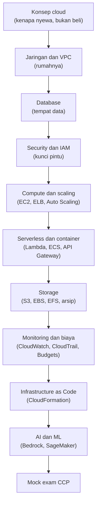
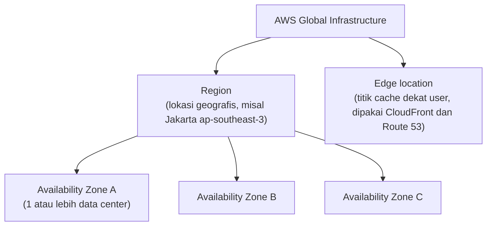
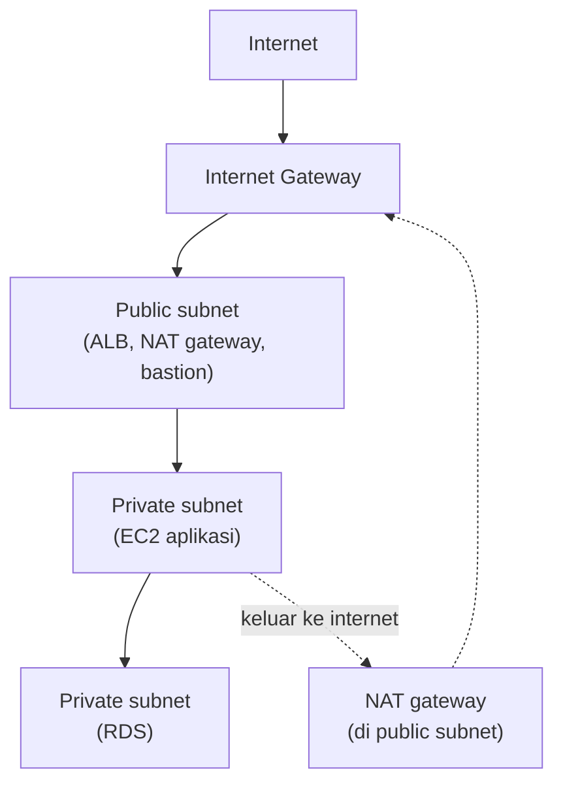
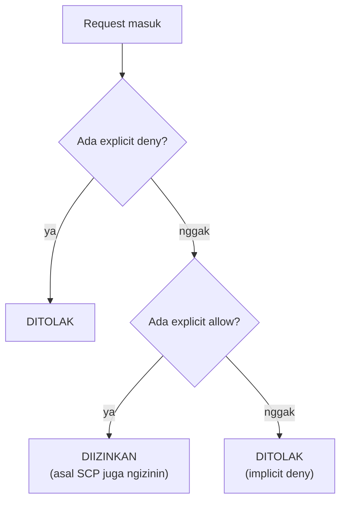
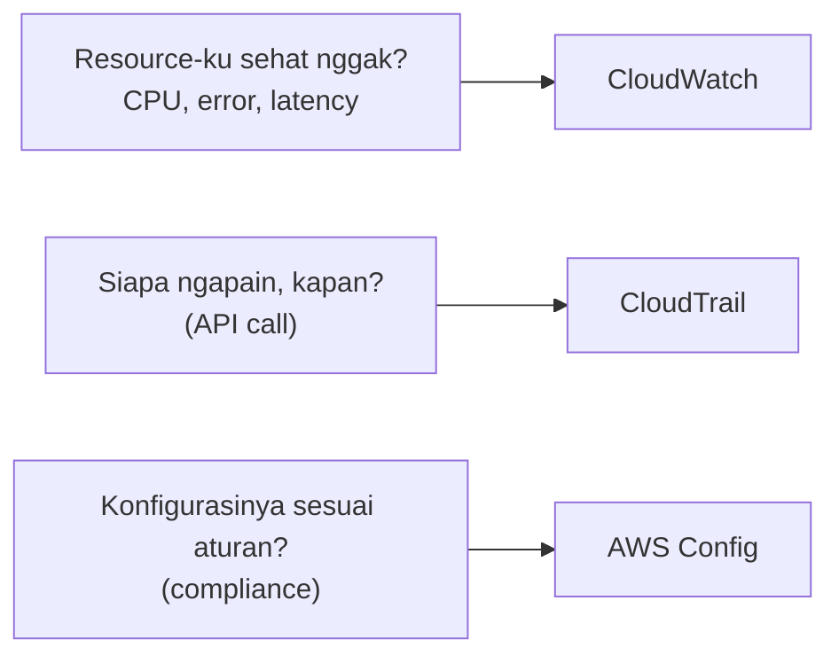
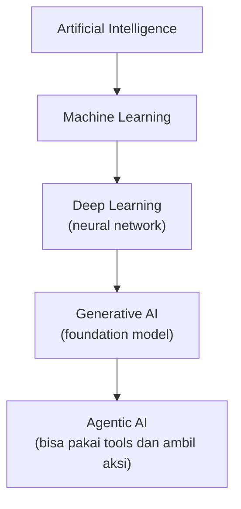
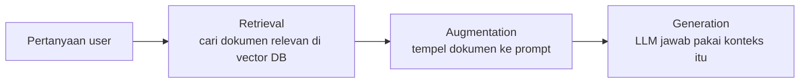

AWS re/Start batch 15 resmi kelar 18 September kemarin. Tujuh minggu, 130 post di blog ini (journal, materi, labs), dan jujur aja, kalau mau ngulang semuanya satu-satu buat persiapan ujian, capek duluan. Jadi post ini dibikin jadi "peta"-nya: semua yang dibahas di re/Start dipadetin ke satu halaman, disaring ke yang beneran kepake buat dua sertifikasi, **AWS Certified Cloud Practitioner (CCP)** dan **AWS Certified AI Practitioner**.

Kalau post ini dibaca pelan-pelan, diulang, sampe nempel, harusnya udah kebayang isi re/Start itu apa aja. Detailnya tetep ada di post aslinya, tinggal klik.

Cara bacanya:

1. **Peta 7 minggu** dulu, biar kebayang alur ceritanya.
2. **Bagian service per kategori**. Tiap tabel ada kolom "kata kunci di soal", itu kata atau frasa yang biasanya muncul di soal ujian dan nunjuk ke service itu.
3. **Glosarium** di bagian bawah buat ngecek istilah yang lupa.
4. Mau detail? Klik link di kolom "Baca lagi", langsung ke post aslinya.

Buat persiapan ujian yang disusun ngikutin exam guide resmi per domain, ada dua post pendamping: [Persiapan Lengkap Ujian CCP](/blog/persiapan-lengkap-ujian-aws-cloud-practitioner-clf-c02) dan [Persiapan Lengkap Ujian AI Practitioner](/blog/persiapan-lengkap-ujian-aws-ai-practitioner-aif-c01). Buat ngafalin service satu per satu, ada [Kamus Service AWS](/blog/kamus-service-aws-fungsi-dan-kegunaannya) yang isinya 150-an service lengkap sama kegunaannya.

> Kalau kolom "Baca lagi" nunjuk ke post [jebakan soal CCP](/blog/jebakan-soal-ccp-mock-exam-week-7), artinya service itu cuma muncul pas mock exam, nggak ada materi atau lab khususnya di kelas. Yang ditandai "exam guide" malah sama sekali nggak dibahas, tapi masuk daftar service resmi ujian.
{: .prompt-tip }

## Peta 7 Minggu re/Start

| Minggu | Tanggal | Tema besar | Journal |
|---|---|---|---|
| 1 | 3-7 Agu | Konsep cloud, EC2 pertama, dasar jaringan, VPC manual, security fundamentals, NAT gateway | [3](/blog/aws-restart-hari-1-kickoff), [4](/blog/aws-restart-hari-2-ec2), [5](/blog/aws-restart-hari-3-ip-dan-vpc), [6](/blog/aws-restart-hari-4-security-dan-vpc-lab), [7](/blog/aws-restart-hari-5-nat-gateway-dan-web-server) |
| 2 | 10-14 Agu | Database (MySQL, RDS, Aurora, DynamoDB), Inspector, KMS, Patch Manager, IAM, Network Firewall, CloudWatch alarm | [10](/blog/aws-restart-week2-hari-1-database-mysql), [11](/blog/aws-restart-week2-hari-2-rds-aurora), [12](/blog/aws-restart-week2-hari-3-aurora-dynamodb), [13](/blog/aws-restart-week2-hari-4-inspector-kms), [14](/blog/aws-restart-week2-hari-5-iam-firewall-cloudwatch) |
| Libur | 17 Agu | Belajar mandiri: CAF, Well-Architected, migrasi data center | [CAF](/blog/aws-cloud-adoption-framework-caf), [WAF](/blog/aws-well-architected-framework), [migrasi](/blog/transitioning-data-center-to-aws) |
| 3 | 18-21 Agu | CLI, IAM policy dan role, S3 static website, Systems Manager, EC2 deep dive, Elastic Beanstalk, ELB, Auto Scaling | [18](/blog/aws-restart-week3-hari-1-cli-dan-s3), [19](/blog/aws-restart-week3-hari-2-systems-manager-ec2), [20](/blog/aws-restart-week3-hari-3-elb-elastic-beanstalk), [21](/blog/aws-restart-week3-hari-4-elb-cli-auto-scaling) |
| 4 | 24-28 Agu | Route 53, CloudFront, Lambda, REST API, API Gateway, Step Functions, container, Redshift, DMS, VPC lanjutan | [24](/blog/aws-restart-week4-hari-1-scaling-route53-cloudfront), [26](/blog/aws-restart-week4-hari-3-rest-api-container-rds), [27](/blog/aws-restart-week4-hari-4-database-vpc), [28](/blog/aws-restart-week4-hari-5-vpc-security-troubleshooting) |
| 5 | 31 Agu-4 Sep | Storage (EBS, EFS, FSx, S3, Glacier, Storage Gateway, Snow), CloudWatch, Athena, Organizations, tagging, biaya, support, incident response | [31](/blog/aws-restart-week5-hari-1-ebs-efs-s3-storage-class), [1](/blog/aws-restart-week5-hari-1-s3-glacier-storage-gateway-monitoring), [2](/blog/aws-restart-week5-hari-3-cloudwatch-logs-organizations), [3](/blog/aws-restart-week5-hari-4-latihan-soal-ccp), [4](/blog/aws-restart-week5-hari-5-cost-incident-response-tagging) |
| 6 | 7-11 Sep | AMI, rightsizing, CloudFormation, 3 hari materi AI | [7](/blog/aws-restart-week6-hari-1-ami-cost-optimization-cloudformation), [8](/blog/aws-restart-week6-hari-2-cloudformation-troubleshooting), [9](/blog/aws-restart-week6-hari-3-materi-ai-hari-pertama), [10](/blog/aws-restart-week6-hari-4-materi-ai-hari-kedua), [11](/blog/aws-restart-week6-hari-5-materi-ai-hari-ketiga) |
| 7 | 14-18 Sep | Review service AI, lab SageMaker, 4 hari mock exam CCP | [14](/blog/aws-restart-week7-hari-1-service-ai-lab-sagemaker), [15](/blog/aws-restart-week7-hari-2-latihan-soal-ccp), [16](/blog/aws-restart-week7-hari-3-latihan-soal-ccp), [17](/blog/aws-restart-week7-hari-4-latihan-soal-ccp) |

Kalau dilihat dari jauh, urutan materinya itu kayak bangun satu aplikasi dari nol sampe siap produksi:

Benang merahnya ada di **kafe fiktif** yang dipakai di banyak lab. Awalnya cuma website statis di [S3](/blog/s3-static-website-hosting), terus butuh fitur order online jadi naik ke [LAMP stack di EC2](/blog/lamp-stack-cafe-online-order), database-nya dipindah ke [RDS](/blog/migrasi-database-ke-rds-via-cli), servernya di-[rightsizing](/blog/cost-optimization-rightsizing-instance), dikasih [load balancer dan Auto Scaling](/blog/auto-scaling-group-ami-launch-template), laporan penjualannya diotomasi pakai [Lambda](/blog/lambda-cafe-sales-report), sampe sempet [kena hack dan diinvestigasi pakai CloudTrail](/blog/incident-response-cloudtrail-athena-hack). Jadi kalau bingung "service ini gunanya apa", coba bayangin posisinya di cerita kafe itu.

## Fondasi Cloud

### Cloud Computing dan 6 Keuntungannya

Cloud computing itu **on-demand delivery** resource IT (compute, storage, database, dan lain-lain) lewat internet, bayarnya **pay-as-you-go**. Kayak nyewa, bukan beli: nggak perlu beli server, rak, AC, UPS, dan gaji satpam data center di depan.

| # | Keuntungan | Intinya |
|---|---|---|
| 1 | Trade fixed expense for variable expense | Modal gede di depan (CapEx) diganti bayar sesuai pemakaian (OpEx) |
| 2 | Benefit from massive economies of scale | Makin banyak customer AWS, makin murah harga per unit |
| 3 | Stop guessing capacity | Nggak perlu nebak kapasitas, tinggal scale naik-turun |
| 4 | Increase speed and agility | Resource siap dalam menit, bukan minggu |
| 5 | Stop spending money running data centers | Fokus ke bisnis, bukan ngurus rak server |
| 6 | Go global in minutes | Deploy ke region lain tinggal pilih |

Jebakan paling sering: "pay-as-you-go" itu jawaban buat **ngeganti biaya modal di depan**, sedangkan "economies of scale" itu jawaban buat **kenapa AWS bisa terus nurunin harga**.

Baca lagi: [keuntungan cloud computing](/blog/keuntungan-cloud-computing), [service model dan scaling](/blog/cloud-computing-service-model-scaling).

### Service Model dan Deployment Model

| Model | Yang kita urus | Contoh |
|---|---|---|
| **IaaS** | OS ke atas (patch, config, aplikasi, data) | EC2 |
| **PaaS** | Aplikasi dan data doang | RDS, Elastic Beanstalk |
| **SaaS** | Tinggal pakai | Google Drive, Gmail |
| **FaaS / serverless** | Kode fungsi doang | Lambda |

Makin ke bawah tabel, makin sedikit yang diurus, tapi makin sedikit juga kontrolnya.

Deployment model ada 3: **cloud** (semua di AWS), **hybrid** (sebagian di cloud, sebagian on-premises, biasanya karena compliance atau data sensitif), dan **on-premises / private** (semua di data center sendiri).

### Global Infrastructure

- **Region**: kumpulan AZ di satu lokasi geografis. Region satu dan lainnya terisolasi.
- **Availability Zone (AZ)**: satu atau lebih data center dengan listrik, pendingin, dan jaringan sendiri. AZ dalam satu region **nggak berbagi single point of failure**, makanya deploy ke beberapa AZ itu kunci high availability.
- **Edge location**: server cache di dekat user, biar konten lebih cepat nyampe.

4 faktor milih region: **latency** (deket user), **compliance / kedaulatan data** (regulasi wajib simpen di negara tertentu), **harga** (region lama biasanya lebih murah), dan **ketersediaan service** (nggak semua service ada di semua region). Kapan pakai banyak region? Disaster recovery, business continuity, latency rendah buat user global, dan data sovereignty.

Scope resource juga sering keluar di soal:

| Scope | Contoh |
|---|---|
| **Global** | IAM, Route 53, CloudFront, Organizations |
| **Region** | VPC, S3 bucket (nama global, data di satu region), DynamoDB, AMI, Lambda |
| **AZ** | Subnet, EBS volume, instance EC2, instance store |

Baca lagi: [VPC, subnet, dan AZ](/blog/vpc-subnet-az-public-private-elastic-ip), [4 scope resource](/blog/persiapan-ujian-ccp-rangkuman-konsep).

### Scaling, High Availability, dan Fault Tolerance

- **Vertical scaling (scale up/down)**: naikin spek satu server. Ada downtime dan ada batas maksimal.
- **Horizontal scaling (scale out/in)**: nambah jumlah server. Nggak ada downtime, nggak ada batas praktis. Ini yang dipakai Auto Scaling.
- **Elasticity**: kemampuan nambah dan ngurangin resource otomatis sesuai beban. Auto Scaling itu contoh elasticity.
- **High availability (HA)**: sistem tetep jalan walau ada yang rusak, meski mungkin "pincang".
- **Fault tolerance**: sistem tetep jalan **dengan performa penuh** walau ada komponen yang rusak, biasanya aktif-aktif.
- **SLA uptime**: 99,9% itu boleh down sekitar 8,77 jam setahun, 99,99% sekitar 52,6 menit. Makin banyak angka 9, makin mahal.

Baca lagi: [ELB dan HA vs FT](/blog/elastic-load-balancing-elb), [tabel angka 9](/blog/aws-well-architected-framework).

### Well-Architected Framework: 6 Pilar

| Pilar | Intinya | Kata kunci di soal |
|---|---|---|
| **Operational excellence** | Jalanin dan monitor sistem, terus diperbaiki | IaC, otomasi, perubahan kecil tapi sering, belajar dari kegagalan |
| **Security** | Lindungi data, sistem, aset | least privilege, enkripsi, traceability, keamanan di semua layer |
| **Reliability** | Sistem jalan sesuai fungsinya dan bisa pulih sendiri | multi-AZ, auto recovery, backup, test recovery |
| **Performance efficiency** | Pakai resource secara efisien | pilih tipe resource yang pas, serverless, go global in minutes |
| **Cost optimization** | Hindari biaya yang nggak perlu | rightsizing, pay-as-you-go, matiin resource nganggur |
| **Sustainability** | Kurangi dampak lingkungan | utilisasi maksimal, managed service, hardware efisien |

Dari mock exam: multi-AZ deployment itu pilar **reliability**, dan Infrastructure as Code masuk pilar **operational excellence**. Instruktur yakin minimal satu soal pilar pasti keluar.

Baca lagi: [Well-Architected Framework](/blog/aws-well-architected-framework).

### Cloud Adoption Framework (CAF): 6 Perspektif

| Fokus | Perspektif | Stakeholder |
|---|---|---|
| Bisnis | **Business** | manajer bisnis, finance, budget owner |
| Bisnis | **People** | HR, people manager |
| Bisnis | **Governance** | CIO, program manager, enterprise architect |
| Teknis | **Platform** | CTO, IT manager, solutions architect |
| Teknis | **Security** | CISO, IT security manager |
| Teknis | **Operations** | IT operations, IT support |

CAF itu panduan migrasi ke cloud biar nggak cuma urusan tim IT. Hasil yang dijanjiin: risiko bisnis turun, performa ESG naik, pendapatan naik, efisiensi operasional naik.

Baca lagi: [CAF](/blog/aws-cloud-adoption-framework-caf), [latihan migrasi data center](/blog/transitioning-data-center-to-aws).

### Shared Responsibility Model

- **Security OF the cloud (AWS)**: infrastruktur fisik, hardware, jaringan global, region, AZ, edge location, virtualisasi.
- **Security IN the cloud (customer)**: data, IAM, konfigurasi, security group, patch OS di EC2, enkripsi.

Pembagiannya **geser tergantung service**:

| Service | Tanggung jawab customer | Tanggung jawab AWS |
|---|---|---|
| **EC2** (IaaS) | patch OS, aplikasi, security group, data | hardware, hypervisor |
| **RDS** (managed) | data, user database, security group, setting backup | patch OS dan engine database |
| **Lambda** (serverless) | kode, IAM role, data | OS, runtime, scaling |
| **S3** | data, bucket policy, pilihan enkripsi | infrastruktur storage, durability |

Ada juga kontrol yang dipegang berdua: patch management, configuration management, dan awareness/training (AWS ngurus punya mereka, customer ngurus punya sendiri).

Baca lagi: [shared responsibility dan CIA triad](/blog/tcp-udp-security-fundamentals).

## Networking: VPC dan Kawan-Kawan

| Komponen | Buat apa | Inget ini | Baca lagi |
|---|---|---|---|
| **VPC** | Jaringan privat kita di satu region | span banyak AZ, CIDR pakai IP privat, CIDR nggak bisa diedit, kuota default 5 VPC per region | [VPC manual](/blog/vpc-manual-cidr-igw-nacl-security-group) |
| **Subnet** | Potongan VPC | cuma di **1 AZ**, 5 IP di tiap subnet direserve AWS | [VPC lanjutan](/blog/amazon-vpc-fundamentals-lanjutan) |
| **Internet Gateway** | Pintu VPC ke internet | 1 VPC 1 IGW, buat **public** subnet | [VPC manual](/blog/vpc-manual-cidr-igw-nacl-security-group) |
| **Route table** | Ngatur arah traffic | subnet jadi "public" kalau ada rute `0.0.0.0/0` ke IGW | [VPC lanjutan](/blog/amazon-vpc-fundamentals-lanjutan) |
| **NAT gateway** | Private subnet bisa keluar ke internet | ditaruh di **public** subnet, cuma satu arah (keluar) | [NAT gateway](/blog/nat-gateway-network-troubleshooting-tools) |
| **Security group** | Firewall level **instance** | **stateful**, cuma bisa allow | [NACL vs SG](/blog/vpc-manual-cidr-igw-nacl-security-group) |
| **Network ACL** | Firewall level **subnet** | **stateless**, bisa allow dan deny, urutan rule penting | [NACL vs SG](/blog/vpc-manual-cidr-igw-nacl-security-group) |
| **Elastic IP** | IP publik statis | tetep bayar walau nganggur, cuma bisa pindah dalam 1 region | [Elastic IP](/blog/vpc-subnet-az-public-private-elastic-ip) |
| **ENI** | Kartu jaringan virtual instance | primary ENI nggak bisa dilepas | [VPC lanjutan](/blog/amazon-vpc-fundamentals-lanjutan) |
| **Bastion host** | Pintu masuk SSH ke private subnet | security group di-chain dari bastion | [bastion](/blog/configuring-vpc-manual-nat-bastion) |
| **VPC endpoint** | Akses service AWS tanpa lewat internet | gateway endpoint cuma S3 dan DynamoDB, sisanya interface endpoint (PrivateLink) | [konektivitas VPC](/blog/vpc-connectivity-options) |
| **VPC peering** | Nyambungin 2 VPC | 1-ke-1, **nggak transitif** | [konektivitas VPC](/blog/vpc-connectivity-options) |
| **Transit Gateway** | Hub buat banyak VPC dan on-premises | lebih efisien kalau VPC-nya lebih dari 2 | [konektivitas VPC](/blog/vpc-connectivity-options) |
| **Site-to-Site VPN** | Konek on-premises ke VPC lewat internet terenkripsi | cepat dipasang, bandwidth nggak konsisten | [konektivitas VPC](/blog/vpc-connectivity-options) |
| **Direct Connect** | Kabel fiber khusus ke AWS | konsisten dan privat, mahal dan lama dipasang | [konektivitas VPC](/blog/vpc-connectivity-options) |
| **VPC Flow Logs** | Log traffic IP masuk-keluar | buat forensik dan troubleshooting | [flow logs](/blog/troubleshooting-vpc-flow-logs) |
| **Network Firewall** | Firewall managed level VPC | rule stateless dan stateful (Suricata) | [Network Firewall](/blog/network-firewall-block-malware) |

Tiga hal yang wajib nempel:

- Subnet baru bener-bener **public** kalau 3 syarat terpenuhi: IGW ke-attach, ada rute ke IGW, dan instance punya IP publik.
- Pertahanan VPC itu berlapis: **route table → NACL → security group → firewall OS**. Troubleshooting juga ngikutin urutan itu.
- Mau **blok IP tertentu**? Pakai **NACL**, karena security group nggak punya rule deny.

### DNS dan Konten Global

| Service | Buat apa | Kata kunci di soal | Baca lagi |
|---|---|---|---|
| **Route 53** | DNS managed, daftar domain, health check | routing policy (simple, weighted, latency, failover, geolocation, geoproximity, multivalue, IP-based), failover DNS | [Route 53](/blog/amazon-route-53-dns-routing) |
| **CloudFront** | CDN, cache konten di edge location | latency rendah buat user global, TTL, origin S3 atau ALB | [CloudFront](/blog/amazon-cloudfront-cdn) |
| **Global Accelerator** | Traffic lewat jaringan global AWS, IP statis anycast | performa aplikasi TCP/UDP global, bukan cache | exam guide |

## Compute

| Service | Buat apa | Kata kunci di soal | Baca lagi |
|---|---|---|---|
| **EC2** | Virtual machine (IaaS) | kontrol penuh OS, instance type, AMI, user data | [EC2 pertama](/blog/ec2-billing-traps-launch-lab) |
| **Elastic Load Balancing** | Bagi traffic ke banyak target, health check | "distribute traffic across AZ", minimal 2 AZ | [ELB](/blog/elastic-load-balancing-elb) |
| **EC2 Auto Scaling** | Nambah dan ngurangin instance otomatis | elasticity, traffic naik-turun, launch template | [Auto Scaling](/blog/ec2-auto-scaling) |
| **Lambda** | Jalanin kode tanpa ngurus server | event-driven, bayar per eksekusi, maksimal 15 menit | [Lambda](/blog/aws-lambda-serverless-computing) |
| **ECS** | Orkestrasi container versi AWS | container, gampang, proprietary | [container](/blog/container-docker-ecs-eks-fargate) |
| **EKS** | Kubernetes managed | Kubernetes, portabel | [container](/blog/container-docker-ecs-eks-fargate) |
| **Fargate** | Jalanin container tanpa ngurus server | serverless container | [container](/blog/container-docker-ecs-eks-fargate) |
| **ECR** | Registry image Docker | "mirip Docker Hub" | [jebakan soal](/blog/jebakan-soal-ccp-mock-exam-week-7) |
| **Elastic Beanstalk** | PaaS, upload kode, sisanya diurus | "upload zip, AWS urus deploy", scalable, di belakangnya CloudFormation | [Beanstalk](/blog/aws-elastic-beanstalk) |
| **Lightsail** | VPS sederhana harga flat | website kecil, **nggak ada auto scaling** | [jebakan soal](/blog/jebakan-soal-ccp-mock-exam-week-7) |
| **Outposts** | Rak hardware AWS di data center sendiri | extend AWS ke on-premises | [rangkuman konsep](/blog/persiapan-ujian-ccp-rangkuman-konsep) |
| **AWS Batch** | Jalanin batch job skala besar | job batch, antrean komputasi | exam guide |

Hal-hal EC2 yang sering keluar:

- **Instance type** dikelompokin per keluarga: general purpose, compute optimized (CPU berat), memory optimized (RAM gede, in-memory database), storage optimized (I/O disk tinggi), accelerated computing (GPU).
- **User data** jalan **sekali** pas instance pertama kali launch. **Instance metadata** diambil dari `169.254.169.254`.
- **Reboot** IP publik tetep, **stop lalu start** dapet IP publik baru. Mau IP tetep? Elastic IP.
- Ganti instance type wajib **stop** dulu. Resize EBS bisa sambil jalan.
- Tagihan EC2 Linux (dan sekarang Windows juga) dihitung **per detik**, minimal 60 detik. Yang kena biaya cuma pas **running**.
- Akses EC2 ke service lain (misal S3) pakai **IAM role lewat instance profile**, bukan access key. Satu instance cuma bisa punya **satu role**.
- Auto Scaling terdiri dari 3 bagian: **launch template**, **Auto Scaling group** (min, desired, max), dan **scaling policy** (target tracking, step, scheduled, predictive). Kalau tanggal event-nya udah tau, jawabannya **scheduled scaling**.

Baca lagi: [instance state](/blog/ec2-instance-states-lifecycle), [metadata dan user data](/blog/ec2-instance-metadata-best-practices), [lab Auto Scaling](/blog/auto-scaling-group-ami-launch-template), [AMI strategy](/blog/ami-building-strategy-jos).

## Storage

Tiga jenis storage: **object** (S3, file utuh plus metadata), **block** (EBS, kayak hard disk), dan **file** (EFS dan FSx, folder yang di-share banyak server).

| Service | Jenis | Buat apa | Kata kunci di soal | Baca lagi |
|---|---|---|---|---|
| **S3** | Object | Nyimpen file apa aja, static website, data lake | durability 11 angka 9, bucket, versioning, lifecycle, presigned URL | [S3 lanjutan](/blog/amazon-s3-storage-class-fundamentals-lanjutan) |
| **S3 Glacier** | Object (arsip) | Arsip jangka panjang paling murah | retrieval menit sampai jam, vault, archive | [Glacier](/blog/amazon-s3-glacier-cold-storage) |
| **EBS** | Block | Disk buat EC2 | terikat **1 AZ**, persisten, snapshot incremental | [EBS](/blog/amazon-ebs-volume-types-snapshot-dlm) |
| **Instance store** | Block | Disk sementara yang nempel fisik | super cepat, **data hilang** pas stop/terminate | [instance store](/blog/ec2-instance-store-temporary-storage) |
| **EFS** | File | File share buat Linux (NFS) | banyak EC2 akses barengan, multi-AZ, elastis | [EFS dan FSx](/blog/amazon-efs-fsx-file-storage) |
| **FSx** | File | File system managed: Windows File Server (SMB), Lustre (HPC), NetApp ONTAP, OpenZFS | Windows, HPC | [EFS dan FSx](/blog/amazon-efs-fsx-file-storage) |
| **Storage Gateway** | Hybrid | Jembatan storage on-premises ke cloud | hybrid storage, File/Volume/Tape Gateway | [Storage Gateway](/blog/aws-storage-gateway-hybrid) |
| **Snow Family** | Transfer offline | Migrasi data raksasa lewat perangkat fisik, udah nggak bisa dipesan customer baru sejak 7 November 2025 | internet lambat, data petabyte, Snowball Edge bisa jalanin EC2 | [Snow Family](/blog/aws-snow-family-offline-transfer) |
| **DataSync** | Transfer online | Sinkronisasi data otomatis ke AWS | sinkron berkala lewat internet | [DataSync](/blog/aws-transfer-family-datasync) |
| **Transfer Family** | Transfer online | SFTP, FTPS, FTP managed ke S3/EFS | partner kirim file pakai FTP | [Transfer Family](/blog/aws-transfer-family-datasync) |
| **AWS Backup** | Backup | Backup terpusat banyak service | kebijakan backup lintas service | [jebakan soal](/blog/jebakan-soal-ccp-mock-exam-week-7) |
| **Elastic Disaster Recovery** | DR | Replikasi server buat DR dengan downtime minimal | disaster recovery, RPO/RTO kecil | [jebakan soal](/blog/jebakan-soal-ccp-mock-exam-week-7) |

S3 storage class, dari paling sering sampe paling jarang diakses:

| Storage class | Cocok buat | Catatan |
|---|---|---|
| **S3 Standard** | Data yang sering diakses | nggak ada biaya retrieval |
| **S3 Intelligent-Tiering** | Pola akses nggak ketebak | pindah tier otomatis, ada biaya monitoring per objek |
| **S3 Standard-IA** | Jarang diakses tapi butuh cepat | lebih murah per GB, ada biaya retrieval |
| **S3 One Zone-IA** | Jarang diakses, boleh hilang kalau AZ rusak | cuma 1 AZ, lebih murah lagi |
| **S3 Glacier Instant Retrieval** | Arsip yang sesekali perlu instan | retrieval milidetik |
| **S3 Glacier Flexible Retrieval** | Arsip | retrieval menit sampai jam |
| **S3 Glacier Deep Archive** | Arsip compliance bertahun-tahun | paling murah, retrieval sampai sekitar 2 hari |

Yang sering keluar juga: **lifecycle policy** buat mindahin objek ke kelas lebih murah otomatis, **versioning** bikin delete jadi soft delete, **Object Lock** buat data yang nggak boleh diubah (WORM), dan data **masuk** ke AWS gratis, **keluar** bayar.

## Database

| Service | Tipe | Buat apa | Kata kunci di soal | Baca lagi |
|---|---|---|---|---|
| **RDS** | Relational (SQL) | Database managed: MySQL, PostgreSQL, MariaDB, Oracle, SQL Server | managed, Multi-AZ, read replica, nggak ada akses OS | [RDS dan Aurora](/blog/rds-aurora-multi-az) |
| **Aurora** | Relational (SQL) | Engine RDS buatan AWS, kompatibel MySQL dan PostgreSQL | performa tinggi, 6 salinan di 3 AZ, Aurora Serverless (ACU) | [Aurora lanjutan](/blog/aurora-lanjutan-acu-cluster-troubleshooting) |
| **DynamoDB** | NoSQL key-value | Database serverless latency milidetik | skala besar, schema-less, partition key | [DynamoDB](/blog/dynamodb-nosql-dasar) |
| **ElastiCache** | In-memory | Cache di depan database (Redis, Memcached, Valkey) | latency super rendah, session store | [jebakan soal](/blog/jebakan-soal-ccp-mock-exam-week-7) |
| **DAX** | In-memory | Cache khusus DynamoDB | "cache buat DynamoDB" | [jebakan soal](/blog/jebakan-soal-ccp-mock-exam-week-7) |
| **Redshift** | Data warehouse | Analitik skala besar, penyimpanan kolom | OLAP, BI, petabyte | [Redshift](/blog/amazon-redshift-data-warehouse) |
| **DocumentDB** | NoSQL dokumen | Database dokumen kompatibel MongoDB | MongoDB | exam guide |
| **Neptune** | Graph | Database graph | relasi kompleks, social network, fraud graph | exam guide |
| **DMS** | Migrasi | Pindahin database dengan downtime minimal | source tetep jalan, CDC | [DMS dan SCT](/blog/aws-dms-sct-migrasi-database) |
| **SCT** | Migrasi | Konversi skema antar engine beda | migrasi heterogen, misal Oracle ke Aurora | [DMS dan SCT](/blog/aws-dms-sct-migrasi-database) |

- **SQL vs NoSQL**: SQL skemanya kaku, relasi antar tabel, biasanya scale vertikal. NoSQL skemanya fleksibel, scale horizontal.
- **Multi-AZ vs read replica**: Multi-AZ buat **ketersediaan** (standby siap failover otomatis). Read replica buat **performa baca**.
- **Database di EC2 vs RDS**: kalau butuh akses **OS** atau jalanin script pas boot, EC2. Kalau mau yang managed, RDS.
- **Restore ke titik waktu tertentu**: point-in-time recovery. **Patch minor version**: fitur auto minor version upgrade di RDS.
- DynamoDB: **Query** jauh lebih murah dari **Scan**, karena Scan baca semua data dulu.

Baca lagi: [database manual di EC2](/blog/database-ec2-ddl-dml-select), [migrasi ke RDS](/blog/migrasi-database-ke-rds-via-cli), [SQL lanjutan](/blog/sql-lanjutan-aggregate-window-function).

## Security, Identity, dan Compliance

### IAM

- **Identity** ada 3: **user** (orang atau aplikasi, kredensial permanen), **group** (kumpulan user), **role** (kredensial sementara, di-assume oleh user, service, atau account lain, wajib punya trust relationship).
- **Policy** itu dokumen JSON, bukan identity. Isinya `Effect`, `Action`, `Resource`, kadang `Principal` (di resource-based policy) dan `Condition`.
- **Identity-based policy** nempel ke user, group, role. **Resource-based policy** nempel ke resource (misal bucket policy).
- Role **nggak bisa** nempel ke group.
- IAM itu **global**, nggak per region.

Best practice IAM yang wajib hafal: **jangan pakai root user** buat kerjaan harian, aktifin **MFA**, terapin **least privilege**, pakai **group** buat ngatur permission, jangan embed access key di kode, dan pakai **role** buat aplikasi. Tugas yang cuma bisa dilakuin root user, contohnya: ganti email atau password root, ganti support plan, dan nutup account.

Pelengkapnya: **IAM Identity Center** (dulu AWS SSO) buat login terpusat ke banyak account, termasuk federasi pakai identity provider luar. **IAM Access Analyzer** buat nyari resource yang ke-share ke luar account. **SCP** di Organizations jadi "atap" permission semua account anggota.

Baca lagi: [policy, permission, role](/blog/iam-policy-permission-role), [IAM praktik](/blog/iam-praktik-password-policy-user-group), [Organizations dan SCP](/blog/aws-organizations-scp).

### Service Keamanan

| Service | Buat apa | Kata kunci di soal | Baca lagi |
|---|---|---|---|
| **KMS** | Bikin dan kelola kunci enkripsi (dikelola AWS) | enkripsi at rest, integrasi banyak service | [KMS](/blog/kms-encrypt-decrypt-symmetric-key) |
| **CloudHSM** | Hardware khusus buat kunci, kita yang pegang | "dedicated hardware", compliance ketat | [jebakan soal](/blog/jebakan-soal-ccp-mock-exam-week-7) |
| **Secrets Manager** | Simpen dan **rotasi otomatis** password, API key | rotasi kredensial database | exam guide |
| **Certificate Manager (ACM)** | Sertifikat SSL/TLS | HTTPS, enkripsi in transit | exam guide |
| **Inspector** | Scan kerentanan EC2, image ECR, Lambda | vulnerability, CVE | [Inspector](/blog/amazon-inspector-vulnerability-scanning) |
| **GuardDuty** | Deteksi ancaman pakai ML dari log | threat detection, aktivitas mencurigakan | [jebakan soal](/blog/jebakan-soal-ccp-mock-exam-week-7) |
| **Detective** | Investigasi akar masalah setelah kejadian | root cause, investigasi | [jebakan soal](/blog/jebakan-soal-ccp-mock-exam-week-7) |
| **Macie** | Nemuin data sensitif (PII) di S3 | PII, data pribadi di bucket | [jebakan soal](/blog/jebakan-soal-ccp-mock-exam-week-7) |
| **Security Hub** | Kumpulin temuan keamanan dari banyak service di satu dashboard | pusat temuan keamanan | exam guide |
| **Shield** | Perlindungan DDoS | Standard gratis otomatis, Advanced berbayar | [jebakan soal](/blog/jebakan-soal-ccp-mock-exam-week-7) |
| **WAF** | Firewall aplikasi web (layer 7) | SQL injection, XSS, blok berdasarkan pola request | [rangkuman konsep](/blog/persiapan-ujian-ccp-rangkuman-konsep) |
| **Firewall Manager** | Ngatur WAF, Shield, security group lintas account | kebijakan firewall terpusat | exam guide |
| **Artifact** | Download laporan compliance dan agreement | SOC, ISO, PCI, "compliance report" | [jebakan soal](/blog/jebakan-soal-ccp-mock-exam-week-7) |
| **Cognito** | Login user buat aplikasi web dan mobile | sign-up, sign-in, login pakai Google | exam guide |
| **Directory Service** | Microsoft Active Directory managed | AD, LDAP | [migrasi data center](/blog/transitioning-data-center-to-aws) |
| **Resource Access Manager** | Share resource antar account | share subnet, share resource | [jebakan soal](/blog/jebakan-soal-ccp-mock-exam-week-7) |

Konsep keamanan yang ikut kebawa: **CIA triad** (confidentiality, integrity, availability), **enkripsi at rest** (data disimpan, pakai KMS) vs **in transit** (data dikirim, pakai TLS), dan kontrol **preventive, detective, corrective**.

Baca lagi: [security fundamentals](/blog/tcp-udp-security-fundamentals), [hardening](/blog/network-system-hardening-firewall-zones), [patch manager](/blog/system-hardening-patch-manager-lanjutan).

## Monitoring, Governance, dan Automasi

Tiga service yang paling sering ketuker, bedainnya pakai pertanyaan:

| Service | Buat apa | Kata kunci di soal | Baca lagi |
|---|---|---|---|
| **CloudWatch** | Metric, alarm, log, dashboard | monitoring, alarm, basic 5 menit gratis, detailed 1 menit bayar, RAM butuh CloudWatch Agent | [CloudWatch](/blog/amazon-cloudwatch-monitoring-overview) |
| **CloudTrail** | Rekam semua API call di account | audit, "who did what", investigasi | [incident response](/blog/incident-response-cloudtrail-athena-hack) |
| **AWS Config** | Rekam histori konfigurasi dan cek compliance | resource non-compliant, config rule | [lab monitoring](/blog/monitoring-infrastructure-cloudwatch-agent-config) |
| **EventBridge** | Event bus: kalau kejadian X, jalanin Y | event-driven, jadwal cron (UTC) | [EventBridge](/blog/cloudwatch-logs-events-eventbridge) |
| **Organizations** | Kelola banyak account, OU, SCP, consolidated billing | multi-account, "member account" | [Organizations](/blog/aws-organizations-scp) |
| **Control Tower** | Setup dan atur multi-account otomatis (landing zone) | "set up multi-account environment" | [jebakan soal](/blog/jebakan-soal-ccp-mock-exam-week-7) |
| **Systems Manager** | Kelola banyak server: Run Command, Session Manager, Patch Manager, Parameter Store | tanpa SSH, patch massal | [Systems Manager](/blog/aws-systems-manager) |
| **CloudFormation** | Infrastructure as Code pakai template JSON/YAML | template, stack, change set, drift | [CloudFormation](/blog/cloudformation-deploy-first-stack) |
| **CDK** | IaC pakai bahasa pemrograman | "familiar programming language" | [jebakan soal](/blog/jebakan-soal-ccp-mock-exam-week-7) |
| **Trusted Advisor** | Cek infrastruktur kita terhadap best practice | cost, performance, security, fault tolerance, service limits, operational excellence | [Trusted Advisor](/blog/aws-support-plans-trusted-advisor) |
| **Health Dashboard** | Status gangguan di sisi AWS | "AWS-nya yang bermasalah" | [jebakan soal](/blog/jebakan-soal-ccp-mock-exam-week-7) |
| **Compute Optimizer** | Rekomendasi rightsizing pakai ML | instance kegedean atau kekecilan | exam guide |
| **Service Catalog** | Katalog produk IT yang udah disetujui | standarisasi resource yang boleh dibikin | exam guide |
| **License Manager** | Kelola lisensi software (BYOL) | lisensi, BYOL | exam guide |
| **Service Quotas** | Lihat dan minta naikin batas (limit) | quota, limit | exam guide |
| **Well-Architected Tool** | Review workload terhadap 6 pilar | review arsitektur | exam guide |

Cara akses AWS ada 4: **Management Console** (klik-klik, buat belajar), **CLI** (command line, buat otomasi), **SDK** (dari kode aplikasi), dan **IaC** (template). Buat kerjaan yang berulang, pilih yang bisa diotomasi.

Catatan kecil: **OpsWorks** (Chef/Puppet managed) masih ada di [materi kelas](/blog/iac-cloudformation-opsworks), tapi AWS udah mensiunin semua varian OpsWorks antara Maret dan Mei 2024. Pengganti yang disaranin AWS buat OpsWorks Stacks itu Systems Manager.

Baca lagi: [CLI query dan filter](/blog/aws-cli-query-filter-dry-run), [tagging](/blog/aws-tagging-cost-management), [drift CloudFormation](/blog/troubleshooting-cloudformation-drift), [IaC dan JSON/YAML](/blog/infrastructure-as-code-json-yaml).

## Integrasi Aplikasi dan Developer Tools

| Service | Buat apa | Kata kunci di soal | Baca lagi |
|---|---|---|---|
| **SNS** | Pub/sub: satu pesan ke banyak subscriber (email, SMS, Lambda) | notifikasi, fan-out, topic | [SNS](/blog/cloudwatch-alarm-sns-notification) |
| **SES** | Kirim email | email doang (konfirmasi order, reset password) | [SES vs SNS](/blog/amazon-cloudwatch-monitoring-overview) |
| **SQS** | Antrean pesan | decoupling, "loosely coupled", buffer | [jebakan soal](/blog/jebakan-soal-ccp-mock-exam-week-7) |
| **Amazon MQ** | Message broker managed (RabbitMQ, ActiveMQ) | migrasi tanpa nulis ulang kode | [kedai kopi](/blog/aws-restart-week7-hari-3-latihan-soal-ccp) |
| **Step Functions** | Orkestrasi workflow banyak langkah | state machine, alur dengan percabangan | [Step Functions](/blog/aws-step-functions) |
| **API Gateway** | Pintu depan API | throttling, caching, REST API | [API Gateway](/blog/amazon-api-gateway) |
| **X-Ray** | Tracing request lintas service | "di mana lemotnya" | [API Gateway](/blog/amazon-api-gateway) |
| **CodeBuild / CodeDeploy / CodePipeline** | CI/CD: build, deploy, dan pipeline-nya | CI/CD, artifact | [latihan soal](/blog/aws-restart-week5-hari-4-latihan-soal-ccp) |
| **Amplify** | Bikin dan deploy aplikasi web/mobile full stack | frontend dan mobile cepat | [latihan soal](/blog/aws-restart-week7-hari-3-latihan-soal-ccp) |
| **Amazon Connect** | Contact center di cloud | customer service, call center | [rangkuman konsep](/blog/persiapan-ujian-ccp-rangkuman-konsep) |
| **WorkSpaces** | Desktop virtual di cloud | virtual desktop, kerja remote | [latihan soal](/blog/aws-restart-week7-hari-3-latihan-soal-ccp) |
| **AppStream 2.0** | Streaming aplikasi desktop ke browser | aplikasi, bukan desktop penuh | exam guide |
| **IoT Core** | Nyambungin dan ngatur perangkat IoT | sensor, device | exam guide |

Konsep yang nyambung: **decoupling** atau **loose coupling** (pisahin komponen biar satu rusak nggak nyeret yang lain), itu dasar **microservice**. Lawannya monolith yang tightly coupled. Analogi dari kelas: kasir (web server) nulis struk (pesan di SQS), barista (backend) ngerjain berurutan.

Baca lagi: [REST API](/blog/restful-api-fundamentals), [lab Lambda kafe](/blog/lambda-cafe-sales-report).

## Analytics

| Service | Buat apa | Kata kunci di soal | Baca lagi |
|---|---|---|---|
| **Athena** | Query data di S3 pakai SQL, serverless | bayar per query, query log CloudTrail/ALB | [Athena](/blog/amazon-athena-serverless-query) |
| **Redshift** | Data warehouse | analitik petabyte, BI | [Redshift](/blog/amazon-redshift-data-warehouse) |
| **Glue** | ETL serverless plus data catalog | ETL tanpa ngurus cluster | [jebakan soal](/blog/jebakan-soal-ccp-mock-exam-week-7) |
| **EMR** | Cluster big data (Hadoop, Spark) | big data, masih ngurus cluster | [jebakan soal](/blog/jebakan-soal-ccp-mock-exam-week-7) |
| **Kinesis** | Streaming data real-time | clickstream, IoT, real-time | [journal minggu 7](/blog/aws-restart-week7-hari-1-service-ai-lab-sagemaker) |
| **MSK** | Kafka managed | udah pakai Kafka | [jebakan soal](/blog/jebakan-soal-ccp-mock-exam-week-7) |
| **QuickSight** | Dashboard BI | visualisasi, dashboard | [jebakan soal](/blog/jebakan-soal-ccp-mock-exam-week-7) |
| **OpenSearch Service** | Search dan analitik log (fork Elasticsearch) | full-text search, log analytics | [rangkuman konsep](/blog/persiapan-ujian-ccp-rangkuman-konsep) |
| **Data Exchange** | Subscribe data dari pihak ketiga | data eksternal | [journal minggu 7](/blog/aws-restart-week7-hari-1-service-ai-lab-sagemaker) |

**ETL** (extract, transform, load) itu proses ngerapihin data berantakan jadi bentuk yang gampang di-query. **Data warehouse** nyimpen data terstruktur buat analitik (OLAP), beda sama database transaksi (OLTP) yang dipake aplikasi. Jangan pernah jalanin analitik berat langsung di database transaksi.

## Migrasi dan Hybrid

Mapping data center tradisional ke AWS dari latihan tanggal 17 Agustus:

| On-premises | Di AWS |
|---|---|
| Server | EC2 |
| SAN (storage block) | EBS |
| NAS (storage file) | EFS |
| Database | RDS |
| Tape backup | S3 / Glacier |
| Load balancer | ELB |
| LDAP | Directory Service |

Service migrasi lainnya: **DMS** dan **SCT** buat database, **Snow Family** buat data raksasa offline, **DataSync** dan **Transfer Family** buat data lewat internet, **Storage Gateway** buat hybrid, **Direct Connect** buat koneksi privat. Yang masuk exam guide tapi nggak dibahas di kelas: **Application Migration Service** (lift-and-shift server), **Application Discovery Service** (inventaris server on-premises), **Migration Evaluator** (bikin business case dan TCO), dan **Migration Hub** (pantau progres migrasi). Strategi migrasinya (7R) dibahas di [post persiapan CCP](/blog/persiapan-lengkap-ujian-aws-cloud-practitioner-clf-c02).

## Billing, Pricing, dan Support

### Model Harga EC2

| Opsi | Hemat | Kapan dipakai |
|---|---|---|
| **Spot** | sampai 90% | paling murah, bisa ditarik AWS dengan peringatan 2 menit, buat kerjaan yang boleh keputus |
| **Savings Plans** | sampai 72% | komit **nominal per jam** selama 1 atau 3 tahun, fleksibel lintas instance (Compute SP juga berlaku ke Fargate dan Lambda) |
| **Reserved Instance Standard** | sampai 72% | komit 1 atau 3 tahun, spek nggak bisa diubah, sisanya bisa dijual di RI Marketplace |
| **Reserved Instance Convertible** | sampai 66% | bisa ganti instance family, nggak bisa dijual |
| **On-Demand** | 0% | jangka pendek, nggak bisa diprediksi |
| **Dedicated Instance** | lebih mahal | VM di hardware yang nggak di-share customer lain |
| **Dedicated Host** | paling mahal | nyewa **server fisik**, buat lisensi yang terikat CPU fisik (BYOL) |
| **Capacity Reservation** | nggak ada diskon sendiri | jaminan kapasitas di AZ tertentu, ditagih harga On-Demand dipake atau nggak |

Yang bisa di-reserve: EC2, RDS, DynamoDB, Redshift. CloudWatch, S3, dan Lambda nggak bisa. Di Organizations, diskon RI dan Savings Plans bisa dinikmatin bareng semua account lewat consolidated billing.

### Tools Biaya

| Tool | Buat apa | Baca lagi |
|---|---|---|
| **Pricing Calculator** | Estimasi biaya **sebelum** pakai | [rightsizing](/blog/cost-optimization-rightsizing-instance) |
| **Cost Explorer** | Analisa dan forecast tagihan yang **udah** jalan | [cost management](/blog/aws-cost-management-tools-budgets) |
| **Budgets** | Alert kalau biaya lewat batas (cuma notifikasi, nggak matiin resource) | [cost management](/blog/aws-cost-management-tools-budgets) |
| **Cost and Usage Report** | Data tagihan paling detail | [cost management](/blog/aws-cost-management-tools-budgets) |
| **Billing alarm CloudWatch** | Alarm tagihan, setup dari region US East (N. Virginia) | [cost management](/blog/aws-cost-management-tools-budgets) |
| **Cost allocation tags** | Pecah biaya per tim atau proyek | [tagging](/blog/aws-tagging-cost-management) |
| **Consolidated billing** | Satu tagihan buat semua account di Organizations, diskon volume digabung | [Organizations](/blog/aws-organizations-scp) |
| **Billing Conductor** | Bikin grup billing dan harga custom (buat reseller) | [journal minggu 7](/blog/aws-restart-week7-hari-2-latihan-soal-ccp) |

### Support Plan

AWS ngerombak support plan-nya tanggal 2 Desember 2025, dan exam guide CCP sekarang udah pakai nama baru:

| Plan | Harga | Yang didapet |
|---|---|---|
| **Basic** | gratis | customer service 24/7, dokumentasi, re:Post, Trusted Advisor check inti, Health Dashboard |
| **Business Support+** | mulai $29 per bulan | akses ahli 24/7 lewat telepon, chat, email, respons di bawah 30 menit buat sistem kritis down, Trusted Advisor lengkap |
| **Enterprise** | mulai $5.000 per bulan | **TAM** khusus, respons di bawah 15 menit |
| **Unified Operations** | mulai $50.000 per bulan | tim engineer spesialis khusus, respons di bawah 5 menit |

Plan lama (**Developer**, **Business**, **Enterprise On-Ramp**) resmi berhenti **1 Januari 2027**, tapi masih sering nongol di bank soal latihan. Detail dua versinya ada di [post persiapan CCP](/blog/persiapan-lengkap-ujian-aws-cloud-practitioner-clf-c02).

Pihak lain yang bisa bantu: **AWS Partner Network** (konsultan dan system integrator), **Marketplace** (beli software pihak ketiga), **Professional Services**, **re:Post** (forum komunitas), **Knowledge Center**, **Activate** (kredit buat startup), dan **Trust and Safety team** (lapor kalau resource AWS dipakai buat nyerang).

Baca lagi: [support plan dan Trusted Advisor](/blog/aws-support-plans-trusted-advisor), [dasar penetapan harga](/blog/dasar-penetapan-harga-aws).

## AI dan Machine Learning

### Taksonomi

- AI, ML, deep learning menghasilkan **model**. Generative AI menghasilkan dan pakai **foundation model (FM)**, model raksasa yang dilatih dari data super banyak dan bisa dipakai buat banyak tugas.
- Jenis FM berdasarkan output: **LLM** (teks), **diffusion model** (gambar, video), **multimodal** (campuran).
- **Inference** itu proses model ngeluarin jawaban dari input baru. **Training** itu proses model belajar dari data.

Baca lagi: [taksonomi AI](/blog/ai-ml-deep-learning-generative-ai-taksonomi).

### Cara Mesin Belajar

| Metode | Data | Tujuan | Contoh |
|---|---|---|---|
| **Supervised** | berlabel | klasifikasi (binary, multi-class), regresi (angka kontinu) | deteksi fraud, prediksi harga |
| **Unsupervised** | tanpa label | clustering, anomaly detection, asosiasi | segmentasi pelanggan, deteksi hacking |
| **Reinforcement** | reward dan punishment dari environment | ambil keputusan berurutan | autopilot mobil, game |

Kapan **nggak** pakai ML? Kalau masalahnya bisa diselesain pakai rule biasa atau statistik sederhana, atau kalau biayanya nggak sebanding sama manfaatnya.

Baca lagi: [klasifikasi, regresi, reinforcement](/blog/klasifikasi-regresi-clustering-reinforcement-learning).

### Data dan Training

- **GIGO** (garbage in, garbage out): data jelek, model jelek. Kata instruktur, 90% kerjaan ML itu ngurus data.
- **Data bias / imbalanced**: proporsi kelas nggak seimbang, prediksinya berat sebelah.
- **Feature engineering** = data preparation: bersihin duplikat, isi data kosong, buang outlier, transformasi.
- **Data labeling**: hierarki folder (buat klasifikasi) atau anotasi bounding box (buat object detection). Di AWS ada **SageMaker Ground Truth**.
- **Split data**: training (belajar), validasi (ngecek belajarnya), test (ujian akhir). Di lab pakai 80/10/10.
- **Overfitting**: bagus di data training, jelek di data baru (ngapalin). **Underfitting**: jelek di dua-duanya (belum belajar).
- **Hyperparameter tuning (HPO/HPT)**: nyari setting algoritma terbaik.
- **Metrik**: AUC (0,5 = tebak-tebakan, makin deket 1 makin bagus), confusion matrix (TP, FP, FN, TN).

Baca lagi: [GIGO dan bias](/blog/data-buat-machine-learning-gigo-bias-feature-engineering), [data labeling](/blog/data-labeling-object-detection-image-segmentation), [lab SageMaker](/blog/lab-sagemaker-training-xgboost).

### LLM dan Generative AI

- **Token**: potongan teks yang diproses model. Tagihan AI pakai API dihitung dari token **input dan output**.
- **Embedding**: ngubah teks jadi **vector** (deretan angka yang mewakili makna). AI cuma bisa baca angka.
- **Vector database**: database buat nyimpen dan nyari vector yang mirip (cosine similarity).
- **Transformer**: arsitektur neural network di balik LLM.
- **Base, instruct, reasoning model**: base belum di-tuning, instruct ngikutin instruksi, reasoning "mikir dulu" (token lebih boros).
- **Temperature, top-p, top-k**: parameter inference. Temperature rendah jawabannya konsisten, tinggi lebih kreatif.
- **Context window dan context engineering**: ngatur apa yang masuk ke "ingatan" model biar relevan dan hemat token.
- **Knowledge cut-off** dan **hallucination**: model nggak tau info setelah tanggal training, dan bisa jawab yakin padahal salah.
- **Quantization**: ngecilin ukuran model dengan ngorbanin sedikit kualitas.

Tiga cara nyesuain output model:

| Cara | Ngubah model? | Biaya | Kapan dipakai |
|---|---|---|---|
| **Prompt engineering** | nggak | paling murah | ngatur gaya dan format jawaban |
| **RAG** | nggak | sedang | model butuh data privat atau terbaru |
| **Fine-tuning** | ya, bobotnya berubah | paling mahal | model perlu jago di domain atau gaya tertentu |

Baca lagi: [vector database dan RAG](/blog/vector-database-rag-embedding), [arsitektur LLM](/blog/arsitektur-llm-transformer-base-instruct-reasoning-model), [biaya deploy AI](/blog/biaya-deploy-ai-token-billing-spek-infra), [ukuran model](/blog/ukuran-model-vs-kepintaran-ai-spesialisasi).

### Responsible AI dan Keamanan AI

- Prinsip responsible AI: **akurat, adil (fair), aman, explainable dan transparan, bisa dikontrol**.
- **Guardrail**: filter dua arah di depan LLM, ngecek input sebelum masuk dan output sebelum keluar. Bisa atur kategori konten, topik terlarang, kata terlarang, dan filter PII. Di AWS namanya **Bedrock Guardrails**.
- **Prompt injection / hijacking**: nyusupin instruksi ke input biar model ngelanggar aturan aslinya. Jangan pernah paste kredensial ke AI.
- Framework adopsi AI dari instruktur: **cost → objective → SDM → privacy**. Data sensitif dan budget ada, pakai AI lokal. Kalau nggak, frontier model lewat API.

Baca lagi: [responsible AI dan guardrail](/blog/responsible-ai-guardrails-prompt-injection), [framework 4 pertanyaan](/blog/framework-4-pertanyaan-adopsi-ai-perusahaan).

### Service AI di AWS

| Service | Input → output | Kata kunci di soal | Baca lagi |
|---|---|---|---|
| **SageMaker AI** | platform ML end-to-end | bikin, training, deploy model sendiri | [service AI](/blog/service-ai-aws-wajib-hafal-ccp) |
| **Bedrock** | akses foundation model siap pakai lewat API | generative AI, LLM, tanpa training dari nol | [service AI](/blog/service-ai-aws-wajib-hafal-ccp) |
| **Lex** | teks/suara → percakapan | chatbot | [service AI](/blog/service-ai-aws-wajib-hafal-ccp) |
| **Polly** | teks → suara | text to speech | [service AI](/blog/service-ai-aws-wajib-hafal-ccp) |
| **Transcribe** | suara → teks | speech to text, subtitle | [service AI](/blog/service-ai-aws-wajib-hafal-ccp) |
| **Translate** | teks → teks bahasa lain | terjemahan | exam guide |
| **Comprehend** | teks → insight | sentiment, entitas, PII | [service AI](/blog/service-ai-aws-wajib-hafal-ccp) |
| **Textract** | dokumen/gambar → teks dan tabel | ekstrak data dari scan, struk, formulir | [service AI](/blog/service-ai-aws-wajib-hafal-ccp) |
| **Rekognition** | gambar/video → label | computer vision, deteksi wajah dan objek | [service AI](/blog/service-ai-aws-wajib-hafal-ccp) |
| **Personalize** | data interaksi user → rekomendasi | "customers also bought" | exam guide |
| **Amazon Q** | asisten generative AI buat kerja dan coding | asisten AI di AWS | exam guide |
| **Trainium / Inferentia** | chip AI buatan AWS | Trainium buat training, Inferentia buat inference | [ukuran model](/blog/ukuran-model-vs-kepintaran-ai-spesialisasi) |

Fitur SageMaker yang disebut di kelas: **Ground Truth** (labeling data), **JumpStart** (foundation model dan model siap pakai), **Data Wrangler** (EDA dan feature engineering), **notebook instance** (Jupyter, bayar selama nyala), **endpoint** (deploy model). Service AI generasi baru yang masuk exam guide AI Practitioner (Nova, AgentCore, Kiro, Strands Agents, Amazon Quick) dibahas di [post persiapan AI Practitioner](/blog/persiapan-lengkap-ujian-aws-ai-practitioner-aif-c01).

## Glosarium A sampai Z

Istilah yang dipakai di post ini, di [kamus service AWS](/blog/kamus-service-aws-fungsi-dan-kegunaannya), dan di dua post persiapan ujian. Kalau nemu kata yang asing di salah satu post itu, cari di sini (Ctrl+F).

### A sampai C

- **Access key**: pasangan ID dan secret buat akses AWS lewat CLI atau SDK. Secret cuma bisa dilihat sekali pas dibikin.
- **ACU (Aurora Capacity Unit)**: satuan kapasitas Aurora Serverless, gabungan CPU dan RAM.
- **Agentic AI**: AI yang nggak cuma jawab, tapi bisa ngerencanain langkah, pakai tools, dan ambil aksi sendiri.
- **AMI (Amazon Machine Image)**: template buat launch EC2, isinya OS plus software. Scope-nya region.
- **Anycast**: satu alamat IP yang sama diumumin dari banyak lokasi, user otomatis diarahin ke lokasi terdekat. Dipakai AWS Global Accelerator.
- **API**: cara program ngobrol sama program lain lewat request dan response.
- **ARN (Amazon Resource Name)**: "alamat" unik tiap resource AWS.
- **Asymmetric key**: sepasang kunci, public key buat enkripsi, private key buat dekripsi.
- **AUC**: luas area di bawah kurva ROC. 0,5 itu tebak-tebakan, 1 itu sempurna.
- **Auto Scaling group**: kumpulan instance yang jumlahnya naik-turun otomatis antara min dan max.
- **Availability Zone (AZ)**: satu atau lebih data center terisolasi di dalam region.
- **Bastion host**: server di public subnet yang jadi satu-satunya pintu SSH ke private subnet.
- **BI (Business Intelligence)**: ngolah data bisnis jadi laporan dan dashboard buat bantu ambil keputusan (Amazon Quick Sight).
- **Bias (data)**: data yang nggak mewakili kondisi sebenarnya, bikin model berat sebelah.
- **Block storage**: storage yang dibagi jadi blok kayak hard disk (EBS, instance store).
- **Blue/green deployment**: versi baru (green) disiapin di samping versi lama (blue), terus traffic dipindah sekaligus. Kalau ada masalah, tinggal balik ke blue.
- **Bucket**: wadah objek di S3. Namanya unik secara global.
- **BYOL (Bring Your Own License)**: pakai lisensi software yang udah dibeli sendiri di AWS.
- **CDN (Content Delivery Network)**: jaringan server cache di dekat user (CloudFront).
- **CDC (Change Data Capture)**: nangkep perubahan data selama migrasi berlangsung (fitur DMS).
- **Change set**: preview perubahan sebelum update stack CloudFormation.
- **Chunking**: motong dokumen panjang jadi potongan kecil sebelum di-embedding buat RAG.
- **CI/CD**: continuous integration dan continuous delivery, alur otomatis dari commit kode sampe deploy.
- **CIA triad**: confidentiality, integrity, availability. Tiga pilar security.
- **CIDR**: notasi rentang IP, contoh `10.0.0.0/16`. Angka di belakang garis miring makin besar, rentangnya makin kecil.
- **Clickstream**: jejak klik dan aktivitas user di website atau aplikasi, biasanya dialirin real-time buat dianalisa (Kinesis).
- **Clustering**: ngelompokin data tanpa label berdasarkan kemiripan.
- **Consolidated billing**: satu tagihan buat banyak account di Organizations.
- **Container**: paket aplikasi plus dependensinya yang jalan di atas satu OS bareng container lain.
- **Context engineering**: ngatur apa aja yang masuk ke context window model biar relevan dan hemat token.
- **Context window**: batas jumlah token yang bisa "diingat" model dalam satu kali proses.
- **Cosine similarity**: cara ngukur kemiripan dua vector dari sudutnya.
- **Crawler**: fitur AWS Glue yang otomatis nyari data dan nyatet strukturnya (skema) ke Data Catalog.
- **CVE (Common Vulnerabilities and Exposures)**: nomor ID standar buat kerentanan software yang udah diketahui publik. Inspector nyari CVE di resource kita.

### D sampai F

- **Data lake**: tempat nyimpen semua data mentah (terstruktur maupun nggak) dalam skala besar, biasanya di S3.
- **Data warehouse**: database khusus analitik, datanya udah rapi, penyimpanannya per kolom (Redshift).
- **DDoS**: serangan banjir traffic dari banyak sumber biar layanan tumbang. Lawannya Shield.
- **Decoupling**: misahin komponen biar satu rusak nggak nyeret yang lain.
- **Deep learning**: bagian dari ML yang pakai neural network berlapis-lapis.
- **Delete marker**: tanda "udah dihapus" di bucket yang pakai versioning. Versi lamanya masih ada.
- **Diffusion model**: model generatif yang bikin gambar dari noise acak yang dibersihin bertahap.
- **Disaster recovery (DR)**: strategi mulihin sistem setelah bencana besar.
- **Drift**: di CloudFormation, kondisi resource yang udah nggak sama dengan template karena diedit manual. Di ML, performa model yang turun karena data di dunia nyata berubah.
- **Durability**: seberapa kecil kemungkinan data hilang. S3 punya durability 99,999999999%. Beda sama availability, yang ngukur seberapa sering data bisa diakses.
- **Edge location**: titik cache dekat user buat CloudFront dan Route 53.
- **Egress / ingress**: traffic keluar / masuk. Ingress ke AWS gratis, egress ke internet bayar.
- **Elastic (di nama service)**: tanda resource-nya bisa digedein, dikecilin, atau dipindah sesuai kebutuhan. Contohnya Elastic Compute Cloud (EC2), Elastic IP, Elastic Load Balancing, Elastic Beanstalk.
- **Elasticity**: kemampuan nambah dan ngurangin resource otomatis sesuai beban.
- **Embedding**: proses ngubah teks, gambar, atau data lain jadi vector.
- **Encryption at rest / in transit**: enkripsi data yang lagi disimpan / lagi dikirim.
- **Endpoint**: di SageMaker, alamat model yang udah di-deploy. Di VPC, jalur privat ke service AWS.
- **ETL**: extract, transform, load. Proses ngerapihin data biar siap dianalisa.
- **Explicit deny**: rule deny yang ditulis jelas di policy. Selalu menang lawan allow.
- **FaaS (Function as a Service)**: nulis fungsi doang, server diurus penyedia (Lambda).
- **Failover**: pindah otomatis ke cadangan pas yang utama rusak.
- **Fan-out**: satu pesan disebar ke banyak penerima sekaligus, misal satu notifikasi SNS diterusin ke beberapa antrean SQS dan Lambda.
- **Fault tolerance**: tetep jalan dengan performa penuh walau ada komponen yang rusak.
- **Feature engineering**: ngolah data mentah jadi fitur yang siap dipakai model.
- **Federasi (federated identity)**: login ke AWS pakai identitas dari sistem lain (Active Directory perusahaan, Google) tanpa bikin IAM user baru.
- **Few-shot / zero-shot prompting**: kasih beberapa contoh / tanpa contoh di prompt.
- **Fine-tuning**: training lanjutan model yang udah jadi pakai data spesifik, bobot modelnya berubah.
- **Foundation model (FM)**: model raksasa hasil pretraining yang bisa dipakai buat banyak tugas.

### G sampai I

- **Generalisasi**: kemampuan model jawab bener pas ketemu data yang belum pernah dilihat.
- **Generative AI**: AI yang bisa bikin konten baru: teks, gambar, audio, video, kode.
- **GIGO**: garbage in, garbage out. Data sampah menghasilkan model sampah.
- **GraphQL**: bahasa query API yang ngebolehin client minta data persis yang dibutuhin dalam satu request. Di AWS lewat AppSync.
- **Guardrail**: di AI, filter di depan dan belakang LLM buat ngeblok input dan output berbahaya (Bedrock Guardrails). Di Control Tower, aturan preventive dan detective yang otomatis dipasang ke semua account (sekarang disebut controls).
- **Hallucination**: model ngasih jawaban yang kedengeran yakin tapi salah atau ngarang.
- **High availability (HA)**: sistem tetep bisa diakses walau ada yang rusak, biasanya pakai multi-AZ.
- **Horizontal scaling**: nambah jumlah server (scale out/in).
- **HPC (High Performance Computing)**: komputasi berat yang butuh banyak server kerja bareng, misal simulasi ilmiah atau render (FSx for Lustre, AWS Batch).
- **HPO / HPT**: hyperparameter optimization / tuning, nyari setting algoritma terbaik.
- **HSM (Hardware Security Module)**: perangkat keras khusus buat nyimpen dan ngolah kunci enkripsi dengan aman (CloudHSM).
- **Hub-and-spoke**: pola jaringan dengan satu pusat (hub) yang nyambung ke banyak cabang (spoke), kayak Transit Gateway.
- **Hybrid cloud**: sebagian infrastruktur di cloud, sebagian on-premises.
- **IaaS**: infrastructure as a service. Sewa server mentah, OS ke atas diurus sendiri (EC2).
- **IaC (Infrastructure as Code)**: infrastruktur didefinisiin pakai template atau kode (CloudFormation, CDK).
- **Implicit deny**: default IAM. Kalau nggak ada yang ngizinin, otomatis ditolak.
- **Inference**: proses model ngeluarin prediksi atau jawaban dari input baru.
- **Instance**: satu virtual machine EC2. Spesifikasinya ditentuin sama instance type (misal `t3.micro`).
- **Instance profile**: "wadah" yang nempelin IAM role ke EC2.
- **Instance store**: disk sementara yang nempel fisik ke host EC2, datanya hilang pas stop.
- **Intrinsic function**: fungsi bawaan CloudFormation kayak `!Ref`, `!GetAtt`, `!Select`.
- **IOPS**: jumlah operasi baca-tulis per detik, ukuran performa disk.
- **ISV (Independent Software Vendor)**: perusahaan yang bikin dan jual software, bagian dari AWS Partner Network. Produknya biasa dijual di AWS Marketplace.

### J sampai M

- **JMESPath**: bahasa query buat nyaring output JSON, dipakai di opsi `--query` AWS CLI.
- **JSON / YAML**: format teks buat nulis data dan template. YAML lebih enak dibaca, tapi sensitif indentasi.
- **Key pair**: pasangan kunci SSH buat login ke EC2 Linux.
- **Knowledge base**: kumpulan dokumen yang jadi "contekan" model di RAG.
- **Knowledge cut-off**: tanggal terakhir data training model.
- **Landing zone**: lingkungan multi-account AWS yang udah disiapin rapi dan aman dari awal (account, OU, aturan, logging), bisa dibikin otomatis pakai Control Tower.
- **Latency**: jeda waktu dari request sampe response.
- **Launch template**: bungkusan setting buat launch instance (AMI, tipe, security group, user data).
- **Layer 4 / layer 7**: lapisan di model jaringan OSI. Layer 4 ngurus koneksi TCP/UDP dan port (Network Load Balancer), layer 7 ngerti isi request aplikasi kayak URL dan header HTTP (Application Load Balancer, WAF).
- **Least privilege**: kasih izin seminimal mungkin yang cukup buat kerja.
- **Lifecycle hook**: jeda di Auto Scaling buat jalanin aksi custom sebelum instance masuk layanan atau dimatiin.
- **Lifecycle policy**: aturan otomatis mindahin atau hapus objek S3 berdasarkan umur.
- **LLM (Large Language Model)**: foundation model yang spesialis teks.
- **Loose coupling**: komponen saling terhubung tapi nggak saling bergantung langsung.
- **Managed service**: service yang infrastrukturnya (server, patch, backup, scaling) diurus AWS, kita tinggal pakai. Makin managed, makin sedikit tanggung jawab kita di shared responsibility model.
- **MCP (Model Context Protocol)**: protokol standar terbuka buat nyambungin model atau agent AI ke tools dan sumber data luar.
- **MFA (multi-factor authentication)**: login pakai dua faktor, misal password plus kode dari aplikasi.
- **Microservice**: aplikasi dipecah jadi service-service kecil yang bisa di-deploy sendiri-sendiri.
- **Multi-AZ**: resource disebar ke beberapa AZ biar tahan kalau satu AZ mati.
- **Multimodal**: model yang bisa nerima atau ngeluarin lebih dari satu jenis data (teks, gambar, suara).
- **Multi-tenant / single-tenant**: hardware atau resource dipakai bareng banyak customer / dipakai satu customer doang (misal CloudHSM, Dedicated Host).

### N sampai P

- **NACL (Network ACL)**: firewall level subnet, stateless, bisa allow dan deny.
- **NAT gateway**: jalur keluar ke internet buat private subnet.
- **NFS / SMB / iSCSI**: protokol buat akses storage lewat jaringan. NFS buat file di Linux (EFS), SMB buat file di Windows (FSx for Windows File Server), iSCSI buat block storage (Volume Gateway).
- **NoSQL**: database non-relasional yang skemanya fleksibel (DynamoDB).
- **Object storage**: storage yang nyimpen file sebagai objek utuh plus metadata dan key (S3).
- **OLTP / OLAP**: database transaksi harian / database analitik.
- **On-demand**: resource bisa dipakai kapan aja tanpa pesen di depan. Di harga EC2, On-Demand artinya bayar per pemakaian tanpa komitmen.
- **On-premises**: infrastruktur di data center sendiri.
- **OU (Organizational Unit)**: grup account di dalam Organizations.
- **Overfitting**: model ngapalin data training, jelek di data baru.
- **PaaS**: platform as a service. Tinggal deploy aplikasi (Elastic Beanstalk, RDS).
- **Partition key / sort key**: kunci utama item di DynamoDB.
- **Pay-as-you-go**: bayar sesuai pemakaian.
- **PII**: personally identifiable information, data yang bisa ngenalin orang (nama, NIK, nomor HP).
- **Point-in-time recovery**: restore database ke detik tertentu di masa lalu.
- **Presigned URL**: link sementara buat akses objek S3 tanpa kasih kredensial.
- **Principal**: siapa yang diizinin atau ditolak di policy.
- **Prompt engineering**: nyusun instruksi ke model biar jawabannya sesuai kebutuhan.
- **Prompt injection**: nyusupin instruksi jahat ke input biar model ngelanggar aturan aslinya.
- **Provisioning**: proses nyiapin atau bikin resource (server, database, jaringan) biar siap dipakai.
- **Pub/sub (publish/subscribe)**: pola pesan di mana pengirim (publisher) kirim ke satu topic, dan semua yang langganan (subscriber) nerima salinannya. Contohnya SNS.

### Q sampai S

- **Quantization**: ngecilin presisi angka di bobot model biar lebih ringan.
- **Query vs Scan**: di DynamoDB, Query pakai key (murah), Scan baca semua item (mahal).
- **RAG (Retrieval-Augmented Generation)**: model nyari dokumen relevan dulu, baru jawab pakai dokumen itu.
- **Read replica**: salinan database buat baca doang, biar database utama nggak keberatan.
- **Region**: lokasi geografis AWS yang isinya beberapa AZ.
- **Reinforcement learning**: belajar dari reward dan punishment.
- **Reserved Instance (RI)**: diskon EC2 dengan komitmen 1 atau 3 tahun.
- **Resource-based policy**: policy yang nempel ke resource, misal bucket policy.
- **Rightsizing**: nyesuain ukuran resource dengan kebutuhan nyata biar nggak bayar lebih.
- **RLHF**: reinforcement learning from human feedback, manusia menilai jawaban model buat ngajarin model.
- **Role (IAM)**: identity dengan kredensial sementara yang bisa di-assume.
- **Root user**: akun pertama pas daftar AWS, aksesnya penuh. Jangan dipakai harian.
- **Route table**: aturan arah traffic di VPC.
- **RPO / RTO**: berapa banyak data yang boleh hilang / berapa lama sistem boleh down pas bencana.
- **SaaS**: software as a service. Tinggal pakai.
- **Savings Plans**: diskon dengan komitmen nominal per jam selama 1 atau 3 tahun.
- **Scalability**: kemampuan sistem nangani beban yang makin besar dengan nambah resource. Beda tipis sama elasticity: scalability soal bisa tumbuh, elasticity soal otomatis naik-turun sesuai beban.
- **SCP (Service Control Policy)**: batas maksimal permission buat account di Organizations.
- **Security group**: firewall level instance, stateful, cuma allow.
- **Serverless**: server tetep ada, tapi sepenuhnya diurus AWS. Bayar sesuai pemakaian.
- **Shared responsibility model**: pembagian tanggung jawab keamanan antara AWS dan customer.
- **SLA**: janji tingkat layanan, biasanya dalam persen uptime.
- **Snapshot**: backup EBS di satu titik waktu. Yang pertama full, berikutnya incremental.
- **Spot Instance**: kapasitas EC2 nganggur yang dijual murah, bisa ditarik kapan aja.
- **SQL injection / XSS**: serangan lewat input aplikasi. SQL injection nyelipin perintah SQL biar database ngejalanin perintah penyerang, XSS (cross-site scripting) nyelipin script jahat biar kejalan di browser korban. Dua-duanya dilawan pakai WAF.
- **SSO (Single Sign-On)**: sekali login bisa masuk ke banyak account atau aplikasi. Di AWS lewat IAM Identity Center.
- **Stack**: kumpulan resource hasil deploy satu template CloudFormation.
- **Stateful / stateless**: inget koneksi (response otomatis diizinin) / nggak inget (dua arah harus diatur).
- **Supervised learning**: belajar dari data berlabel.
- **Symmetric key**: satu kunci buat enkripsi dan dekripsi.
- **System integrator (SI)**: perusahaan konsultan yang bantu implementasi dan integrasi sistem di AWS, bagian dari AWS Partner Network.

### T sampai Z

- **Tag**: label key-value di resource, gratis, buat identifikasi, otomasi, dan pecah biaya.
- **TAM (Technical Account Manager)**: kontak teknis khusus dari AWS yang bantu arsitektur dan operasional, didapet di support plan Enterprise ke atas.
- **Target group**: kumpulan target (instance, IP, Lambda) di belakang load balancer.
- **TCO (Total Cost of Ownership)**: total biaya kepemilikan, dipake buat bandingin on-premises vs cloud.
- **Temperature**: parameter inference yang ngatur seberapa acak jawaban model.
- **Throttling**: ngerem jumlah request biar sistem nggak tumbang.
- **Throughput**: jumlah data atau request yang bisa diproses per satuan waktu, misal MB per detik atau request per detik.
- **Token**: potongan teks yang diproses model, dasar tagihan AI.
- **Top-p / top-k**: parameter inference yang ngebatesin kandidat kata yang dipertimbangkan model.
- **Transformer**: arsitektur neural network di balik LLM.
- **TTL (Time to Live)**: berapa lama data boleh disimpan di cache sebelum diambil ulang.
- **Underfitting**: model belum belajar cukup, jelek di data training maupun data baru.
- **Unsupervised learning**: belajar dari data tanpa label.
- **User data**: script yang jalan otomatis sekali pas instance pertama kali launch.
- **Vector**: deretan angka yang mewakili makna data.
- **Vector database**: database buat nyimpen dan nyari vector yang mirip.
- **Versioning**: nyimpen semua versi objek S3, biar bisa balik ke versi lama.
- **Vertical scaling**: naikin spek server (scale up/down).
- **VPC**: jaringan privat virtual di AWS.
- **VPC endpoint**: akses service AWS dari VPC tanpa lewat internet.
- **VPC peering**: koneksi langsung antar 2 VPC, nggak transitif.
- **Warmup**: masa tunggu instance baru di Auto Scaling sebelum metric-nya dihitung.
- **Workload**: sekumpulan resource dan kode yang bareng-bareng ngejalanin satu fungsi bisnis, misal satu aplikasi e-commerce lengkap sama database-nya.
- **WORM**: write once read many, data yang nggak bisa diubah (S3 Object Lock, Glacier Vault Lock).
- **Zero spend budget**: budget $0 di AWS Budgets, langsung ngasih tau begitu ada biaya sekecil apapun.

## Yang Perlu Diinget

- CCP itu soal **ngenalin service dan konsep**, bukan ngoding atau desain arsitektur. Hafalin pasangan "kata kunci di soal → service".
- Tiga pasangan paling sering ketuker: CloudWatch vs CloudTrail vs Config, Security group vs NACL, KMS vs CloudHSM.
- Shared responsibility geser tergantung service: makin managed, makin banyak yang diurus AWS.
- Harga EC2 termurah: Spot, lalu Savings Plans/RI, lalu On-Demand, lalu Dedicated.
- Buat AI: bedain SageMaker AI (bikin model sendiri) vs Bedrock (pakai foundation model), dan prompt engineering vs RAG vs fine-tuning.
- Lanjut ke post persiapan [CCP](/blog/persiapan-lengkap-ujian-aws-cloud-practitioner-clf-c02) dan [AI Practitioner](/blog/persiapan-lengkap-ujian-aws-ai-practitioner-aif-c01) buat checklist per domain ujian, dan [Kamus Service AWS](/blog/kamus-service-aws-fungsi-dan-kegunaannya) buat ngafalin service.

## Referensi Resmi

- [AWS Certified Cloud Practitioner (CLF-C02) Exam Guide](https://docs.aws.amazon.com/aws-certification/latest/cloud-practitioner-02/cloud-practitioner-02.html)
- [AWS Certified AI Practitioner (AIF-C01) Exam Guide](https://docs.aws.amazon.com/aws-certification/latest/ai-practitioner-01/ai-practitioner-01.html)
- [Overview of Amazon Web Services (whitepaper)](https://docs.aws.amazon.com/whitepapers/latest/aws-overview/introduction.html)
- [AWS Well-Architected Framework](https://docs.aws.amazon.com/wellarchitected/latest/framework/welcome.html)
- [AWS Glossary](https://docs.aws.amazon.com/glossary/latest/reference/glos-chap.html)
- [AWS Support Plans](https://aws.amazon.com/premiumsupport/plans/)
